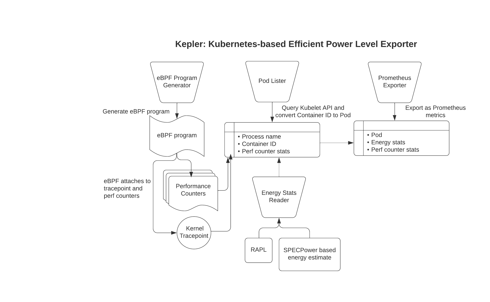
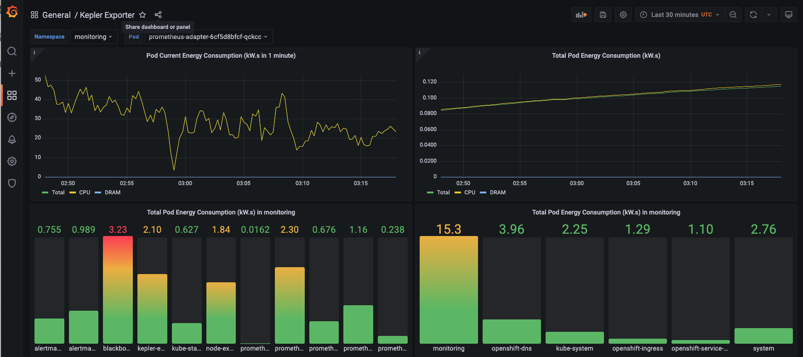

<!--

-->

# Kepler
Kepler (Kubernetes Efficient Power Level Exporter) uses eBPF to probe energy-related system stats and exports them as Prometheus metrics.

## Architecture
Kepler Exporter exposes a variety of [metrics](https://sustainable-computing.io/design/metrics/) about the energy consumption of Kubernetes components such as Pods and Nodes. 

## Install Kepler
Instructions to install Kepler can be found in the [Kepler docs](https://sustainable-computing.io/installation/kepler/).

## Visualise Kepler metrics with Grafana
To visualise the power consumption metrics made available by the Kepler Exporter, import the pre-generated [Kepler Dashboard](grafana-dashboards/Kepler-Exporter.json) into Grafana:
 

## Contribute to Kepler
Interested in contributing to Kepler? Follow the [Contributing Guide](CONTRIBUTING.md) to get started!

## Talks & Demos
- [Kepler Demo](https://www.youtube.com/watch?v=P5weULiBl60)
- ["Sustainability the Container Native Way" - Open Source Summit NA 2022](doc/OSS-NA22.pdf)

A full list of talks and demos about Kepler can be found [here](https://github.com/sustainable-computing-io/kepler-doc/tree/main/demos).

## Community Meetings
Please join the biweekly community meeting, starting on 8-9AM US ET (UTC−05:00) every other Tuesdays. 

[Download](https://us06web.zoom.us/meeting/tZApfumrrzgpHdwUQbkSOj0zpoGveKMMvxaD/ics?icsToken=98tyKuGsqjIqGdWWsx6PRpwIBor4c-nzmHZegqdKqS7nCBN8aFPsJu1lJLdUPfXG) the biweekly community meeting iCalendar file.
