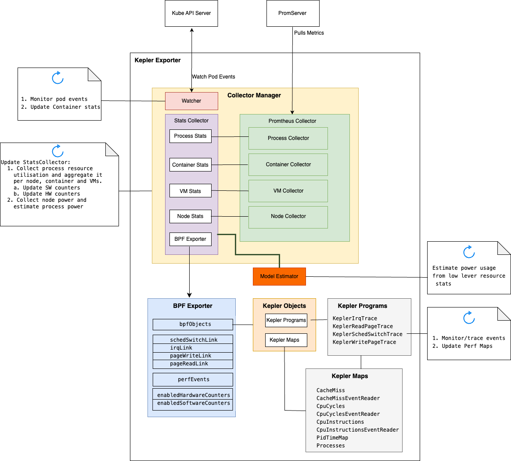
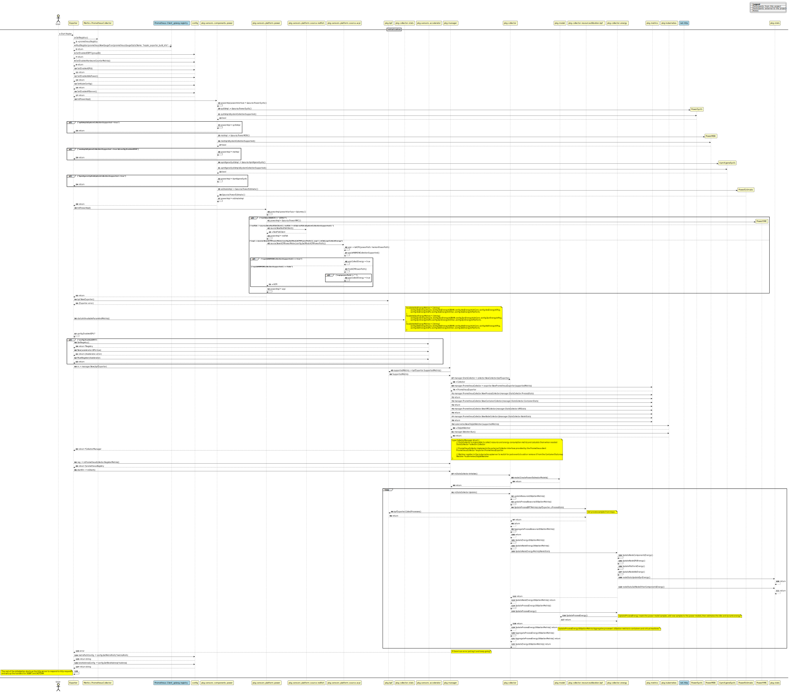

# Kepler Exporter Design

This document provides a simple overview of the design of the Kepler
Exporter, a tool for measuring and reporting the power utilization of a
system and its running processes.

> **_NOTE_**: This guide it not intended to replace the detailed Kepler
[overview](https://sustainable-computing.io/usage/deep_dive/) but rather provide
a starting point for a new contributor to this repo.

Kepler monitors system processes by tracking task switches in the Kernel and
logging stats. These stats are then used to estimate the power usage of the system
and its associated processes. Kepler collects power data using:

- EBPF/Hardware Counters
- Real-time Component Power Meters (e.g., RAPL)
- Platform Power Meters (ACPI/IPMI, etc.)

Below is a high-level representation of the Kepler Exporter components:



Metrics in Kepler can be broken down into 2 categories:

1. Resource metrics.
1. Energy metrics.

## Exporter Introduction

Package: `cmd/exporter`

The `Exporter` is the main Kepler program, performing the following operations:

- Starting various power collection implementations needed to collect metrics from
the platform and its components (DRAM, uncore, core, package).
- Creating a BPF exporter.
- Creating a collector manager to collect and expose the collected metrics.
- Creating an HTTP endpoint that exposes metrics to Prometheus.

Below is the startup sequence for the Kepler Exporter:



> **_NOTE_**: Depending on the environment that Kepler was deployed in,
the system power consumption metrics collection will vary (Baremetal/VM).
For more details on this please see the [detailed documentation][1].

The following sections will cover the main functionality of the various Kepler
components.

## BPF Exporter

Package: `pkg/bpf`

The bpf exporter is created in the main Kepler program through
the collector manager instantiation:

```golang
 m := manager.New(bpfExporter)
```

The role of the bpf exporter is to setup the bpf programs that collect
the low level resource metrics associated with each process. It's
functionality includes:

1. Modifying the eBPF program sampling rate and number of CPUs.
1. Loading the eBPF program.
1. Attaching the `KeplerSchedSwitchTrace` eBPF program.
1. Attaching the `KeplerIrqTrace` eBPF program if `config.ExposeIRQCounterMetrics`
   is enabled.
1. Initializing `enabledSoftwareCounters`.
1. Attaching the `KeplerReadPageTrace` eBPF program.
1. Attaching the `KeplerWritePageTrace` eBPF program.
1. If `config.ExposeHardwareCounterMetrics` is enabled it creates the following
   hardware events:
   1. CpuInstructionsEventReader
   1. CpuCyclesEventReader
   1. CacheMissEventReader

   It also initializes `enabledHardwareCounters`.

## CollectorManager

The Kepler Exporter (cmd/exporter) creates an instance of the `CollectorManager`.
The `CollectorManager` contains the following items:

- `StatsCollector` that is responsible for collecting resource and energy consumption
   metrics. It uses the model implementation to estimate the process energy (total
   and per component) and node energy (using the resource stats).
- `PrometheusCollector` which is a prometheus exporter that exposes the Kepler
  metrics on a Prometheus-friendly URL.
- `Watcher` that watches the Kubernetes API server for pod events.

```golang
type CollectorManager struct {
    // StatsCollector is responsible for collecting resource and energy consumption metrics and calculating them when needed
    StatsCollector *collector.Collector

    // PrometheusCollector implements the external Collector interface provided by the Prometheus client
    PrometheusCollector *exporter.PrometheusExporter

    // Watcher register in the kubernetes API Server to watch for pod events to add or remove it from the ContainerStats map
    Watcher *kubernetes.ObjListWatcher
}
```

On initialization the `CollectorManager` also creates the power estimator models.

### StatsCollector

Package: `pkg/manager`

`StatsCollector` is responsible for updating the following stats:

- Node Stats
- Process stats
- Container stats
- VM stats

> **_NOTE_**: these stats are updated by various subsystems.

When the [collector manager](#collectormanager) is started by the Kepler Exporter,
it kicks off an endless loop that updates the stats periodically.

For process statistics, the Process collector uses a BPF process collector to
retrieve information collected by the Kepler BPF programs and stored in BPF
maps. This information includes the process/executable name, PID, cgroup,
CPU cycles, CPU instructions, cache misses, and cache hits. The BPF process
collector checks if these processes belong to a VM or container. It also
aggregates all the Kernel processes' metrics (which have a cgroup
ID of 1 and a PID of 1). If GPU statistics are available per process,
the stats are extended to include GPU compute and memory utilization.

Node energy stats are also retrieved (if collection is supported). These stats
include the underlying component stats (core, uncore, dram, package, gpus, ...),
as well as the overall platform stats (Idle + Dynamic energy), and the
the process energy consumption. the process energy consumption is estimated
using its resource utilization and the node components energy consumption.

`StatsCollector` eventually passes all the metrics it collects to `pkg/model` through
`UpdateProcessEnergy()`, which estimates the power consumption of each process.

> **_NOTE_**: For details on the Ratio Power Model, refer to this [explanation][2].

### PrometheusCollector

Package: pkg/manager

`PrometheusCollector` supports multiple collectors: container, node, VM and process.
The various collectors implement the `prometheus.Collector` interface. Each of these
collectors fetch the Kepler metrics and expose them on a Prometheus-friendly URL.
In Kepler the stats structures are shared between the PrometheusCollector(s) and
the StatsCollector(s).

The `prometheus.Collector` interface defines the following functions:

- `Describe` sends the super-set of all possible descriptors of metrics
   collected by this Collector to the provided channel and returns once
   the last descriptor has been sent.
- `Collect` is called by the Prometheus registry when collecting metrics.
   The implementation sends each collected metric via the provided channel
   and returns once the last metric has been sent.

## Power Model Estimator

Estimates power usage from the low level resource stats.

> **_NOTE_** for more details please see [3]

[1]: https://sustainable-computing.io/usage/deep_dive/#collecting-system-power-consumption-vms-versus-bms
[2]: https://sustainable-computing.io/usage/deep_dive/#ratio-power-model-explained
[3]: https://sustainable-computing.io/kepler_model_server/power_estimation/
