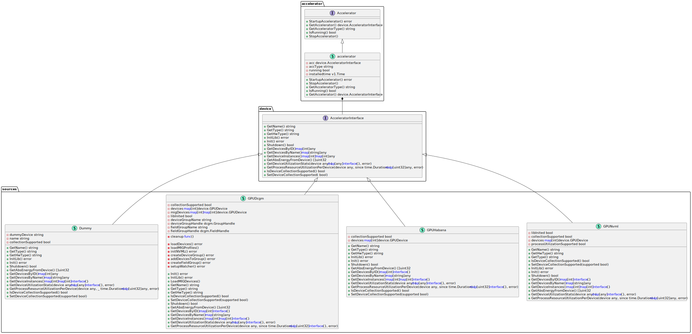

# Accelerators package overview

The following diagram represents a high level view of the accelerators package.

## Detailed Overview of the accelerators package

The idea behind this package is to provide a high level interface that can represent multiple device types while
also hiding the implemetation details of each device.

### Core Interfaces and Structures
### Accelerator Interface:

The Accelerator interface represents the highest level interface that core kepler packages must interact with
in order to collect accelerator metrics. It defines the core operations that any accelerator must support. This
includes methods for starting up, stopping, checking the running status, and retrieving the accelerator type and
underlying implementation.

### Device Interface:

The device.AcceleratorInterface sits one layer under the accelerator interface and provides a homogeneous
interface for interacting with multiple accelerator devices. Essentially, It provides a more granular set of
methods specific to individual devices. This interface includes methods for initializing and shutting down the
device, retrieving device information, and collecting device-specific metrics and utilization statistics.

### Device Implementations

Various concrete implementations of the device.AcceleratorInterface are provided, each tailored to a specific type of hardware accelerator. These include:

#### Dummy
Represents a dummy device implementation.
Implements all methods defined in device.AcceleratorInterface, returning predefined or mock values.

#### GPUDcgm
Represents a GPU device managed via DCGM (Data Center GPU Manager).
Maintains a collection of GPU devices and their associated metrics.
Implements device.AcceleratorInterface to provide GPU-specific initialization, shutdown, and data collection methods.

#### GPUNvml
Similar to GPUDcgm, but uses the NVIDIA Management Library (NVML) for managing GPU devices.
Also maintains a collection of GPU devices and implements methods to interact with these devices using NVML.

#### QATTelemetry
Represents devices using Intel's QuickAssist Technology (QAT).
Maintains device-specific information and implements the interface methods to collect telemetry data and manage QAT devices.

## Impact and Benefits of this architecture

The use of interfaces (Accelerator and device.AcceleratorInterface) provides a layer of abstraction, allowing different device types to be managed uniformly. The Accelerator struct doesn't need to know the specifics of the device; it just calls the interface methods.

### Flexibility

This implementation enhances flexibility by allowing new types of devices to be integrated with kepler more
easily. As long as a new device implementation adheres to the device.AcceleratorInterface, it can be used
interchangeably within the Accelerator struct.

### Maintainability

Improved maintainability due to clear separation of concerns. Device-specific logic is encapsulated within concrete implementations, while the Accelerator struct focuses on higher-level operations.

Overall, this accelerators implementation simplifies the integration of new devices and enhances the project's architecture by leveraging interfaces and polymorphism.
