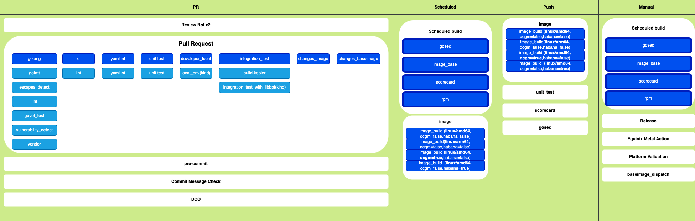

# Github workflows

## Overview

This document provides a summary of the GitHub workflows that form the
Continuous Integration (CI) and Continuous Deployment (CD) pipeline for the
Kepler project.

## Workflow Triggers

The Kepler GitHub Actions workflows are organized based on how they are
triggered:

- **Manual**: `workflow_dispatch`
- **Pull Request**: `pull_request`
- **Scheduled**: `schedule`
- **Push (Merge to Main)**: `push`

## Workflow Overview

The following is a high-level representation of the Kepler workflows:



### Workflow Hierarchy

The following tree provides a high-level overview of the workflow files and the
sub-workflows they invoke:

```text
.
├── baseimage_dispatch.yml
│   └── image_base.yml
├── commitMsg.yml
├── daily.yml
│   ├── gosec.yml
│   ├── image_base.yml
│   ├── image.yml
│   ├── scorecard.yml
│   └── rpm.yml
├── equinix_metal_flow.yml
├── image_pr.yml
├── mock_acpi.yml
├── platform-validation.yml
├── pre-commit.yml
├── pull_request.yml
│   ├── c.yml
│   ├── golang.yml
│   ├── yamllint.yml
│   ├── unit_test.yml
│   ├── developer_local.yml
│   └── integration_test.yml
├── push_request.yml
│   ├── image.yml
│   ├── scorecard.yml
│   ├── unit_test.yml
│   └── gosec.yml
├── release.yml
├── scorecard.yml
└── validator.yml
```

## Suggestions for improvement

There are multiple redundancies, particularly with image.yml, scorecard.yml,
unit_test.yml, and gosec.yml being repeated across daily and push workflows.
Consolidating these could reduce duplication and improve efficiency.

The duplicated workflows include:

1. `image.yml` appears in both:

   - `daily.yml`
   - `push_request.yml`

   **Potential improvement**: If this workflow runs on push, running it again
   daily might be redundant.

1. `scorecard.yml` appears in both:

   - `daily.yml`
   - `push_request.yml`

   **Potential improvement**: If the scorecard.yml runs as part of the daily
   workflow, it might be unnecessary in push_request.yml.

1. `unit_test.yml` appears in both:

   - `pull_request.yml`
   - `push_request.yml`

   **Potential improvement**: Since unit tests are already run for pull
   requests, running them again on push may not be needed.

1. `gosec.yml` appears in both:

   - `daily.yml`
   - `push_request.yml`

   **Potential improvement**: If gosec.yml is part of the daily run, it may
   not be necessary to trigger it on push.

## Scheduled workflows

### Daily

This workflow is a scheduled CI/CD pipeline for the kepler repository. It
automates:

- Daily security scans using gosec and OpenSSF Scorecard.
- Building and pushing Docker base images and final images.
- Building RPM packages for distribution.
- Each job is conditionally run only on the kepler repository, ensuring that
  the workflow doesn't execute in forks or unrelated repositories. The workflow
  uses repository secrets for Docker authentication, enabling image pushing to
  a registry.

**Triggers**:

- workflow_dispatch: Allows manual execution of the workflow.
- branch_protection_rule: Triggers the workflow when a branch protection rule
  is updated.
- schedule: Runs daily at 9:12 AM (UTC).

**Steps**:

- gosec (Go Security Scan)
- image_base (Base Image Build)
- image (Image Build)
- scorecard (OpenSSF Security Scan)
- rpm (RPM Package Build)

#### gosec

This workflow performs static security analysis using Gosec on Go code and
uploads the results in SARIF format to GitHub, where the findings can be
reviewed in the security section. It's a useful tool for identifying
security issues without failing the build based on the findings.

**Triggers**:

It runs whenever called by another workflow using workflow_call.

**Steps**:

- Checkout Source
- Run Gosec Security Scanner and output results to a SARIF file.
- Upload SARIF file.

#### image_base

This workflow builds a base image for building Kepler with libbpf. It includes
cross-platform builds and supports image signing and optional pushing to the
quay.io registry.

**Triggers**:

It runs whenever called by another workflow using workflow_call. Uses a flag
`pushImage` (default: true) to determine whether the built image should be pushed
to the container registry.

**Steps**:

- Checkout the source.
- Set up QEMU (for cross-platform emulation)
- Set up Docker Buildx
- Set up Cosign
- Login to Quay (conditional): If `pushImage`is set to true, this step logs
  into Quay.io using the provided credentials.
- Build and Push Base Image: If `pushImage` is true, the image will be pushed
  to Quay.io.
- Sign Images with Cosign using a GitHub OIDC token for verification.

#### image

This workflow builds and optionally pushes Docker images for Kepler and Kepler
Validator with support for multi-platform builds, image signing, and SBOM
generation. It handles different image variants (e.g., dcgm, habana) through matrix
configuration, ensuring flexibility in the build process. Kepler Image Variants:
linux/arm64 and linux/amd64 (with different build arguments including:
`INSTALL_DCGM` and `INSTALL_HABANA` flags).

**Triggers**:

It runs whenever called by another workflow using workflow_call. Uses a flag
`pushImage` (default: true) to determine whether the built image should be pushed
to the container registry.

**Steps**:

- Checkout the source code.
- Set up QEMU (for cross-platform emulation)
- Set up Docker Buildx:
- Set up Cosign
- Login to Quay (conditional): If `pushImage`is set to true, this step logs
  into Quay.io using the provided credentials.
- Build and Push Base Image: If `pushImage` is true, the image will be pushed
  to Quay.io.
- Sign Images with Cosign using a GitHub OIDC token for verification.
- Generate SBOM in SPDX format. The SBOM tracks dependencies and licensing
  information.
- Save SBOM as Artifact (conditional): If `pushImage` is true, the SBOM file is
  uploaded as a workflow artifact and retained for one day. This can be used
  for auditing purposes.

#### scorecard

This workflow automates security analysis for keplers's supply chain using
OpenSSF Scorecard. It helps identify vulnerabilities and security risks related
to supply chain dependencies, ensuring the repository follows best practices.

**Triggers**:

It runs whenever called by another workflow using workflow_call.

**Steps**:

- Checkout the source code.
- Run Scorecard analysis and place results in SARIF file.
- Upload the SARIF results to GitHub’s code scanning dashboard

#### rpm

This workflow is responsible for automatically building RPM packages for Kepler
on a daily basis.

**Triggers**:

The workflow is triggered by other workflows using workflow_call.

**Steps**:

- Get the current date
- Checkout the source code
- Get the git version.
- Build RPM packages using the environment variables:
  - _VERSION_: Set to the current Git version retrieved from the git_version
    step.
  - _RELEASE_: Set to the date retrieved from the date step, which serves as
    the release identifier for the RPM package.
  - _COMMITTER_: Set to "nightly", indicating the committer for this package
    build.
  - _ARCH_: Set to x86_64, defining the architecture for the RPM package.

  After the build, the RPM files are packaged into a tarball
  (kepler.rpm.tar.gz) located in the `/tmp` directory.
- Save/upload the Kepler RPM as a workflow artifact

## Pull Request workflow actions

### DCO

**File**: Is not using a local workflow file but rather
[probot/github app](https://probot.github.io/apps/dco/)

### Commit Message Check

**File**: [commitMsg.yml](../../.github/workflows/commitMsg.yml)

This GitHub workflow, is triggered by pull requests. Its purpose is to
validate that the commit messages in a pull request adhere to conventional
commit guidelines by ensuring that developers follow a consistent commit
message format, improving readability and automating versioning based on
the commit history. Key Components:

**Triggers**:

The workflow runs whenever a pull request is made.

### Review Bot

**File**: [review_bot.yml](../../.github/workflows/review_bot.yml)

This GitHub workflow, automates a review bot that responds to pull requests,
issues, comments, and discussions when triggered.

**Triggers**:

The workflow is configured to be triggered by one of the following event:

- When an issue is opened.
- When a new comment is created on an issue.
- When pull requests are opened, edited, synchronized, or commented on.
- When a review comment is created.
- When a discussion or a discussion comment is created.

But the job runs only if:

- It’s a pull request or pull request target event.
- The event is from a forked repository.
- The bot @SeineSailor is mentioned in an issue, pull request review comment,
  or discussion.

**Steps**:

- Check Mentions in Comments: This step checks if the bot is mentioned outside
  of code blocks or quoted text within comments. It ensures that the mention is
  intentional and actionable.
- Debugging Event Payload: Dumps the event payload for debugging purposes.
- Run SeineSailor: Executes the SeineSailor bot using the action
  SeineAI/SeineSailor.

### Pre-Commit

**File**: [pre-commit.yml](../../.github/workflows/pre-commit.yml)

This workflow automates the running of pre-commit hooks during the pull request
process to ensure that code changes adhere to predefined standards. The
pre-commit hooks can include linting, formatting, and other checks to enforce
code consistency and quality before changes are merged.

**Triggers**:

The workflow runs whenever a pull request is opened or updated.

**Steps**:

- Check out source: Uses actions/checkout to pull the repository code.
- Set up Python: Uses actions/setup-python to configure Python in the
  environment, as pre-commit often depends on Python for its hooks.
- Run pre-commit hooks: Uses pre-commit/action to execute the pre-commit
  hooks defined in the [.pre-commit-config.yaml](../../.pre-commit-config.yaml)
  file.

### Pull Request

**File**: [pull_request.yml](../../.github/workflows/pull_request.yml)

This workflow automates code quality checks, linting, unit tests, and
integration tests for pull requests. It also includes conditional logic
to detect changes in image-related files and only trigger Docker image
builds when relevant files are modified.

**Triggers**:

The workflow runs when a pull request is opened, except if the modified
files are in `doc/`, `enhancements/`, or are Markdown files.

**Steps**:

It defines several jobs that run various checks and tests
for each pull request:

- [c](#c): Run c checks on the repo.
- [golang](#golang): Runs Go command-line checks on the repo.
- [yamllint](#yamllint): Runs YAML linting on yaml files in the repo.
- [Unit Test](#unit-test): Executes the Kepler unit tests.
- [Developer Local](#developer-local): Runs tests in a Docker container.
- [Integration Test](#integration-test): Executes the Kepler e2e tests.

There are two additional steps for managing image-related changes:

- Changes Image: Detects changes in specific Docker-related files (e.g.,
  image.yml, Dockerfile) using the dorny/paths-filter action. If changes
  are detected, the Image job runs the image.yml workflow but doesn't push
  the image to the registry.
- Changes Baseimage: Similar to the image detection, this job monitors
  base image files (e.g., image_base.yml, Dockerfile.builder) for changes.

#### c

**File**: [c.yml](../../.github/workflows/c.yml)

This GitHub workflow, is designed to perform basic checks on the C code,
in the Kepler repo, ensuring it builds and is correctly formatted. The
workflow is triggered via workflow_call, meaning it is intended to be
reused or called by other workflows.

#### golang

**File**: [golang.yml](../../.github/workflows/golang.yml)

This workflow runs a comprehensive suite of checks for Go projects, ensuring:

- Code formatting with gofmt.
- Memory efficiency with escape detection.
- Code quality through linting (golangci-lint).
- Bug detection using go vet.
- Security by running govulncheck.
- Correct dependency management by validating the vendor directory.

**Triggers**:

The workflow is triggered using `workflow_call`, meaning it can be called by
other workflows.

**Steps**:

- gofmt_test: Ensures that Go code is formatted according to the gofmt
  standard.
- escapes_detect: Detects any unnecessary memory allocations ("escapes") in Go
  code.
- golangci: Performs linting using golangci-lint.
- govet_test: Runs the go vet tool to catch suspicious constructs, such as bugs
  or stylistic issues.
- vulnerability_detect: Detects security vulnerabilities using Go's govulncheck
  tool.
- vendor: Ensures that the vendor directory is up-to-date with the current Go
  modules.

#### Yamllint

**File**: [yamllint.yml](../../.github/workflows/yamllint.yml)

This workflow ensures that the YAML files in the repository conform to the
rules defined in the .yamllint.yaml configuration file.

**Triggers**:

This workflow is set up to be triggered by other workflows using the
workflow_call event.

#### Unit Test

**File**: [unit_test.yml](../../.github/workflows/unit_test.yml)

The Unit test workflow is designed to run unit tests for a the project and
upload the test coverage reports to Codecov.

**Triggers**:

This workflow is set up to be triggered by other workflows using the
workflow_call event.

**Steps**:

- Checkout the repository.
- Install dependencies.
- Get Ginkgo.
- Prepare environment.
- Run tests.
- Upload coverage reports to Codecov.

#### Developer Local

**File**: [developer_local.yml](../../.github/workflows/developer_local.yml)

The developer local workflow is designed to spin up a `kind` cluster and run
the kepler unit tests and benchmarks inside a container.

**Triggers**:

This workflow is set up to be triggered by other workflows using the
workflow_call event.

#### Integration Test

**File**: [integration_test.yml](../../.github/workflows/integration_test.yml)

The Integration test workflow is designed to build, test, and deploy the Kepler
in akind cluster.

**Triggers**:

This workflow is set up to be triggered by other workflows using the
workflow_call event.

**Steps**:

- Build Kepler Docker image and save it as an artifact.
- Build the Kepler manifests with options: `CI_DEPLOY DEBUG_DEPLOY` .
- Push the Kepler image to a local registry.
- Deploy a Kind cluster.
- Deploy Kepler in the Kind cluster.
- Run the e2e tests.
- Undeploy Kepler.
- Tear down the Cluster.

## Merge to main workflows

The following workflows run when PRs are pushed to main:

- [image](#image)
- [unit test](#unit-test)
- [scorecard](#scorecard)
- [gosec](#gosec)
