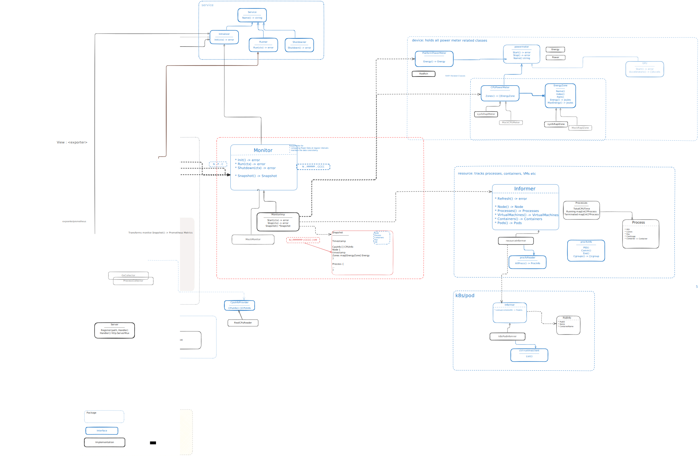

# System Components

This document provides a detailed breakdown of Kepler's architectural components, their responsibilities, and how they interact to achieve accurate power attribution.

## Component Overview

Kepler follows a layered architecture with clear separation of concerns:



**Component Layers:**

```text
┌─────────────────────────────────────────────────────────────┐
│                    Entry Point                              │
│              (cmd/kepler/main.go)                          │
└─────────────────────┬───────────────────────────────────────┘
                      │
┌─────────────────────▼───────────────────────────────────────┐
│                Service Framework                            │
│              (internal/service/)                            │
└─┬─────────────┬─────────────┬─────────────┬─────────────────┘
  │             │             │             │
  ▼             ▼             ▼             ▼
┌─────┐    ┌─────────┐   ┌─────────┐   ┌──────────┐
│Device│    │Resource │   │ Monitor │   │ Export   │
│Layer │    │ Layer   │   │  Layer  │   │  Layer   │
└─────┘    └─────────┘   └─────────┘   └──────────┘
```

## 1. Entry Point (`cmd/kepler/main.go`)

The main entry point orchestrates the entire application lifecycle using dependency injection and service composition.

### Responsibilities

- **Configuration Management**: Parse CLI flags, YAML files, and apply defaults
- **Service Composition**: Create and wire up all services with proper dependencies
- **Lifecycle Orchestration**: Initialize → run → shutdown coordination
- **Error Handling**: Graceful failure handling and cleanup

### Key Functions

```go
func main() {
    cfg := parseArgsAndConfig()           // Configuration hierarchy
    logger := configureLogger(cfg)        // Structured logging
    services := createServices(cfg)       // Dependency injection
    service.Init(services)                // Sequential initialization
    service.Run(services)                 // Concurrent execution
}
```

### Service Creation Flow

```go
func createServices(logger *slog.Logger, cfg *config.Config) ([]service.Service, error) {
    // 1. Create hardware abstraction
    cpuPowerMeter := createCPUMeter(cfg)

    // 2. Create resource monitoring (optional pod informer)
    resourceInformer := resource.NewInformer(opts...)

    // 3. Create core power monitor
    powerMonitor := monitor.NewPowerMonitor(cpuPowerMeter, opts...)

    // 4. Create web server
    apiServer := server.NewAPIServer(opts...)

    // 5. Create exporters (conditional)
    if cfg.Exporter.Prometheus.Enabled {
        promExporter := createPrometheusExporter(cfg, apiServer, powerMonitor)
    }

    return services, nil
}
```

## 2. Service Framework (`internal/service/`)

Provides common interfaces and lifecycle management for all services, implementing the service-oriented architecture pattern.

### Service Framework Interfaces

```go
// Base service interface
type Service interface {
    Name() string
}

// Lifecycle-specific interfaces
type Initializer interface {
    Service
    Init() error  // Called sequentially during startup
}

type Runner interface {
    Service
    Run(ctx context.Context) error  // Called concurrently
}

type Shutdowner interface {
    Service
    Shutdown() error  // Called during graceful shutdown
}
```

### Lifecycle Management

The service framework coordinates the application lifecycle:

1. **Sequential Initialization**: Services implementing `Initializer` are initialized one by one
2. **Concurrent Execution**: Services implementing `Runner` are started concurrently using `oklog/run`
3. **Graceful Shutdown**: On any service failure or signal, all services are shut down in proper order

### Error Handling

```go
func Init(logger *slog.Logger, services []Service) error {
    initialized := make([]Service, 0, len(services))

    for _, s := range services {
        if err := s.Init(); err != nil {
            // On failure, shutdown all previously initialized services
            shutdownInitialized(initialized)
            return fmt.Errorf("failed to initialize %s: %w", s.Name(), err)
        }
        initialized = append(initialized, s)
    }
    return nil
}
```

## 3. Device Layer (`internal/device/`)

Abstracts hardware energy sensors with pluggable implementations, providing the foundation for all power measurements.

### Device Layer Interfaces

```go
type CPUPowerMeter interface {
    service.Service
    service.Initializer
    Zones() ([]EnergyZone, error)
    PrimaryEnergyZone() (EnergyZone, error)
}

type EnergyZone interface {
    Name() string                    // Zone identifier (package, core, dram, uncore)
    Index() int                     // Zone index for multi-socket systems
    Path() string                   // sysfs path for debugging
    Energy() (Energy, error)        // Current energy reading in microjoules
    MaxEnergy() Energy              // Maximum value before wraparound
}
```

### RAPL Implementation (`raplPowerMeter`)

The production implementation reads from Intel RAPL sensors via sysfs:

```go
type raplPowerMeter struct {
    reader      sysfsReader          // Abstracts sysfs access
    cachedZones []EnergyZone        // Cached zone list
    logger      *slog.Logger        // Component logger
    zoneFilter  []string            // Optional zone filtering
    topZone     EnergyZone          // Primary zone for attribution
}
```

**Key Features:**

- **Zone Filtering**: Configurable inclusion of specific zones (package, core, dram, uncore)
- **Multi-Socket Support**: Automatic aggregation of zones across multiple CPU sockets
- **Standard Path Detection**: Prefer standard RAPL paths over non-standard ones
- **Caching**: Cache zone discovery for performance

### Zone Strategy

RAPL zones are prioritized for power attribution:

```go
// Priority hierarchy (highest to lowest priority)
priorityOrder := []string{"psys", "package", "core", "dram", "uncore"}
```

**Zone Descriptions:**

- **psys**: Platform-level energy (most comprehensive)
- **package**: CPU package energy (includes cores + uncore)
- **core**: CPU core energy only
- **dram**: Memory energy
- **uncore**: Uncore/cache energy

### Fake Implementation (`fakeRaplMeter`)

Development implementation for systems without RAPL support:

```go
type fakeRaplMeter struct {
    logger     *slog.Logger
    zones      []EnergyZone
    devicePath string
}
```

**Features:**

- **Configurable Zones**: Specify which zones to simulate
- **Realistic Energy Progression**: Monotonically increasing energy values
- **Random Variation**: Add realistic energy consumption patterns

## 4. Resource Monitoring (`internal/resource/`)

Tracks system processes, containers, and VMs by reading the `/proc` filesystem and integrating with container runtimes and Kubernetes.

### Resource Informer Interface

```go
type Informer interface {
    service.Service
    service.Initializer
    Refresh() error              // Update all resource information
    Node() *Node                // Get node-level CPU information
    Processes() *Processes      // Get process information
    Containers() *Containers    // Get container information
    VirtualMachines() *VirtualMachines  // Get VM information
    Pods() *Pods               // Get pod information (if Kubernetes enabled)
}
```

### Resource Classification

The resource informer automatically classifies processes:

```go
type ProcessType int

const (
    RegularProcess ProcessType = iota
    ContainerProcess
    VMProcess
)
```

**Classification Logic:**

1. **Container Detection**: Check cgroup paths for container runtime signatures
2. **VM Detection**: Identify hypervisor processes (KVM/QEMU)
3. **Regular Process**: Default classification for non-containerized processes

### Container Runtime Support

Supports multiple container runtimes:

```go
type ContainerRuntime int

const (
    UnknownRuntime ContainerRuntime = iota
    Docker
    Containerd
    CRIO
    Podman
)
```

**Detection Method**: Parse cgroup paths to identify runtime-specific patterns:

- Docker: `/docker/container_id`
- Containerd: `/system.slice/containerd.service`
- CRI-O: `/machine.slice/libpod-container_id.scope`
- Podman: `/user.slice/user-1000.slice/...`

### Data Structures

```go
type resourceInformer struct {
    logger *slog.Logger
    fs     allProcReader        // procfs abstraction
    clock  clock.Clock          // Time source (mockable for testing)

    // Resource caches
    procCache      map[int]*Process       // Process cache by PID
    containerCache map[string]*Container  // Container cache by ID
    vmCache        map[string]*VirtualMachine  // VM cache by ID
    podCache       map[string]*Pod        // Pod cache by ID

    // Current state
    processes *Processes
    containers *Containers
    vms *VirtualMachines
    pods *Pods

    // Kubernetes integration
    podInformer pod.Informer
}
```

### Refresh Process

The `Refresh()` method follows a specific order to maintain data consistency:

```go
func (ri *resourceInformer) Refresh() error {
    // 1. Refresh processes (foundation)
    containerProcs, vmProcs, err := ri.refreshProcesses()

    // 2. Refresh containers and VMs in parallel (independent)
    go func() { cntrErrs = ri.refreshContainers(containerProcs) }()
    go func() { vmErrs = ri.refreshVMs(vmProcs) }()
    go func() { nodeErrs = ri.refreshNode() }()

    // 3. Refresh pods (depends on containers)
    podErrs = ri.refreshPods()

    return errors.Join(cntrErrs, vmErrs, nodeErrs, podErrs)
}
```

### CPU Time Tracking

Critical for power attribution, CPU time deltas are calculated:

```go
func populateProcessFields(p *Process, proc procInfo) error {
    prevCPUTime := p.CPUTotalTime

    // Get current CPU time from /proc/PID/stat
    currentCPUTime := proc.CPUTotalTime()

    // Calculate delta since last refresh
    p.CPUTimeDelta = currentCPUTime - prevCPUTime
    p.CPUTotalTime = currentCPUTime

    return nil
}
```

## 5. Power Monitoring (`internal/monitor/`)

The core component that orchestrates measurement and power attribution, implementing the main business logic.

### Power Monitor Interface

```go
type PowerDataProvider interface {
    Snapshot() (*Snapshot, error)    // Get current power data (thread-safe)
    DataChannel() <-chan struct{}    // Notification channel for new data
    ZoneNames() []string             // Available RAPL zones
}
```

### PowerMonitor Structure

```go
type PowerMonitor struct {
    // External dependencies
    logger    *slog.Logger
    cpu       device.CPUPowerMeter
    resources resource.Informer

    // Configuration
    interval     time.Duration    // Collection interval
    maxStaleness time.Duration    // Data freshness threshold

    // Thread-safe state
    snapshot     atomic.Pointer[Snapshot]  // Current power data
    computeGroup singleflight.Group        // Prevent redundant calculations
    exported     atomic.Bool               // Track export state

    // Terminated workload tracking
    terminatedProcessesTracker  *TerminatedResourceTracker[*Process]
    terminatedContainersTracker *TerminatedResourceTracker[*Container]
    terminatedVMsTracker        *TerminatedResourceTracker[*VirtualMachine]
    terminatedPodsTracker       *TerminatedResourceTracker[*Pod]
}
```

### Thread Safety Guarantees

- **All public methods** (except `Init()`) are thread-safe
- **Single Writer**: Only one goroutine updates snapshots
- **Multiple Readers**: Concurrent access to snapshots is safe
- **Atomic Operations**: State changes use atomic operations
- **Singleflight Protection**: Prevents redundant calculations

### Collection Lifecycle

```go
func (pm *PowerMonitor) Run(ctx context.Context) error {
    ticker := pm.clock.NewTicker(pm.interval)
    defer ticker.Stop()

    for {
        select {
        case <-ticker.C():
            pm.scheduleNextCollection()  // Trigger collection
        case <-ctx.Done():
            return ctx.Err()
        }
    }
}
```

### Snapshot Structure

```go
type Snapshot struct {
    Timestamp time.Time  // When this snapshot was created

    // Current running workloads
    Node              *Node
    Processes         map[string]*Process
    Containers        map[string]*Container
    VirtualMachines   map[string]*VirtualMachine
    Pods              map[string]*Pod

    // Terminated workloads (for fair attribution)
    TerminatedProcesses      []*Process
    TerminatedContainers     []*Container
    TerminatedVirtualMachines []*VirtualMachine
    TerminatedPods           []*Pod
}
```

## 6. Export Layer (`internal/exporter/`)

Exposes power data through multiple exporters following the Model-View pattern.

### Prometheus Exporter

Production-ready exporter that integrates with the Prometheus ecosystem:

```go
type Exporter struct {
    logger          *slog.Logger
    monitor         Monitor
    registry        *prom.Registry
    server          APIRegistry
    debugCollectors map[string]bool
    collectors      map[string]prom.Collector
}
```

**Collectors:**

- **Power Collector**: Node, process, container, VM, pod power metrics
- **Build Info Collector**: Version and build information
- **CPU Info Collector**: Hardware topology information
- **Debug Collectors**: Go runtime and process metrics (optional)

### Metrics Level Control

Users can configure exactly which metrics to expose:

```go
type Level int

const (
    MetricsLevelNode Level = iota
    MetricsLevelProcess
    MetricsLevelContainer
    MetricsLevelVM
    MetricsLevelPod
    MetricsLevelAll
)
```

### Stdout Exporter

Development-focused exporter for immediate data inspection:

```go
type Exporter struct {
    monitor Monitor
    logger  *slog.Logger
}

func (e *Exporter) Run(ctx context.Context) error {
    for {
        select {
        case <-e.monitor.DataChannel():
            snapshot, _ := e.monitor.Snapshot()
            e.printSnapshot(snapshot)  // Human-readable output
        case <-ctx.Done():
            return ctx.Err()
        }
    }
}
```

## 7. Configuration System (`config/`)

Implements hierarchical configuration management with validation and type safety.

### Configuration Structure

```go
type Config struct {
    Log      Log      `yaml:"log"`
    Host     Host     `yaml:"host"`
    Monitor  Monitor  `yaml:"monitor"`
    Rapl     Rapl     `yaml:"rapl"`
    Exporter Exporter `yaml:"exporter"`
    Web      Web      `yaml:"web"`
    Kube     Kube     `yaml:"kube"`
    Debug    Debug    `yaml:"debug"`
    Dev      Dev      `yaml:"dev"`
}
```

### Key Configuration Areas

**Monitoring Configuration:**

```go
type Monitor struct {
    Interval  time.Duration `yaml:"interval"`   // Collection interval
    Staleness time.Duration `yaml:"staleness"`  // Freshness threshold

    MaxTerminated int   `yaml:"maxTerminated"`  // Terminated workload limit
    MinTerminatedEnergyThreshold int64 `yaml:"minTerminatedEnergyThreshold"`
}
```

**Hardware Configuration:**

```go
type Rapl struct {
    Zones []string `yaml:"zones"`  // Zone filtering
}

type Host struct {
    SysFS  string `yaml:"sysfs"`   // Hardware sensor path
    ProcFS string `yaml:"procfs"`  // Process information path
}
```

### CLI Integration

Configuration is integrated with CLI flags using `kingpin`:

```go
func RegisterFlags(app *kingpin.Application) func(*Config) error {
    // Create flags for all configuration options
    logLevel := app.Flag("log.level", "Log level").String()
    monitorInterval := app.Flag("monitor.interval", "Monitor interval").Duration()

    return func(cfg *Config) error {
        // Apply CLI overrides to configuration
        if *logLevel != "" { cfg.Log.Level = *logLevel }
        if *monitorInterval != 0 { cfg.Monitor.Interval = *monitorInterval }
        return nil
    }
}
```

## Component Interactions

### Data Flow Between Components

1. **Resource Informer** scans `/proc` → classifies processes → tracks CPU time
2. **Device Layer** reads RAPL sensors → provides energy measurements
3. **Power Monitor** combines resource + energy data → calculates attribution
4. **Exporters** read snapshots → present data in different formats

### Dependency Graph

```text
Entry Point
    ├── Service Framework
    ├── Configuration System
    └── Services:
        ├── Pod Informer (optional)
        ├── Resource Informer (depends on Pod Informer)
        ├── Device Layer (independent)
        ├── Power Monitor (depends on Resource + Device)
        ├── API Server (independent)
        └── Exporters (depend on Power Monitor + API Server)
```

### Error Handling Strategy

- **Graceful Degradation**: Non-critical errors don't stop the system
- **Error Propagation**: Critical errors bubble up through the service framework
- **Logging**: All errors are logged with appropriate context
- **Recovery**: Services can recover from transient errors

---

## Next Steps

After understanding the system components:

- **[Data Flow & Attribution](data-flow.md)**: Learn how components work together for power attribution
- **[Concurrency](concurrency.md)**: Understand thread safety patterns across components
- **[Interfaces](interfaces.md)**: Study the contracts between components
