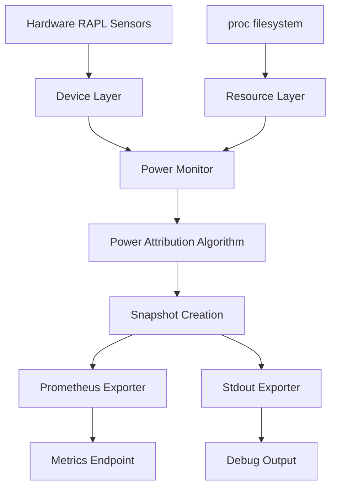

# Data Flow & Power Attribution

This document explains how Kepler transforms raw hardware energy readings into accurate, fair power attribution across different workload levels.

## Overview

Kepler's power attribution algorithm follows a 4-phase process that ensures mathematical consistency and fair energy distribution:

```text
Phase 1: Hardware Collection → Phase 2: Node Breakdown → Phase 3: Workload Attribution → Phase 4: Hierarchical Aggregation
```

## System Data Flow


**Data Flow Sequence:**



## Phase 1: Hardware Energy Collection

### RAPL Sensor Reading

The Device Layer reads energy consumption from Intel RAPL (Running Average Power Limit) sensors:

```go
func (pm *PowerMonitor) collectHardwareEnergy() (map[EnergyZone]Energy, error) {
    zones, err := pm.cpu.Zones()
    if err != nil {
        return nil, err
    }

    energyReadings := make(map[EnergyZone]Energy)
    for _, zone := range zones {
        energy, err := zone.Energy()  // Read from /sys/class/powercap/intel-rapl
        if err != nil {
            continue
        }
        energyReadings[zone] = energy
    }

    return energyReadings, nil
}
```

### Counter Wraparound Handling

RAPL counters are finite and wrap around at maximum values:

```go
func calculateEnergyDelta(current, previous, maxEnergy Energy) Energy {
    if current >= previous {
        return current - previous  // Normal case
    }

    // Handle wraparound: counter reset to 0
    return (maxEnergy - previous) + current
}
```

### Energy Zone Types

| Zone        | Description            | Coverage                 | Priority |
|-------------|------------------------|--------------------------|----------|
| **psys**    | Platform system energy | CPU + Memory + I/O       | Highest  |
| **package** | CPU package energy     | Cores + Uncore + Cache   | High     |
| **core**    | CPU cores only         | Processing units         | Medium   |
| **dram**    | Memory energy          | System memory            | Medium   |
| **uncore**  | Uncore energy          | Cache, memory controller | Low      |

## Phase 2: Node Energy Breakdown

### Active vs Idle Split

Node energy is split based on CPU usage ratio from `/proc/stat`:

```go
func (pm *PowerMonitor) calculateNodePower(prev, current *Node) error {
    // Get CPU usage ratio from /proc/stat
    cpuUsageRatio := pm.resources.Node().CPUUsageRatio

    for zone, energyDelta := range energyDeltas {
        // Split energy between active and idle
        activeEnergy := Energy(float64(energyDelta) * cpuUsageRatio)
        idleEnergy := energyDelta - activeEnergy

        current.Zones[zone] = NodeUsage{
            EnergyTotal:       prev.Zones[zone].EnergyTotal + energyDelta,
            Power:            Power(energyDelta / timeDelta),
            ActiveEnergyTotal: prev.Zones[zone].ActiveEnergyTotal + activeEnergy,
            ActivePower:      Power(activeEnergy / timeDelta),
            IdleEnergyTotal:  prev.Zones[zone].IdleEnergyTotal + idleEnergy,
            IdlePower:        Power(idleEnergy / timeDelta),
            activeEnergy:     activeEnergy,  // Internal field for attribution
        }
    }

    return nil
}
```

### Mathematical Relationship

```text
Total Node Energy = Active Energy + Idle Energy
Active Energy = Total Energy × CPU Usage Ratio
Idle Energy = Total Energy × (1 - CPU Usage Ratio)
```

## Phase 3: Workload Attribution

### CPU Time-Based Attribution

Active energy is distributed to workloads proportionally based on their CPU time consumption:

```go
func (pm *PowerMonitor) calculateProcessPower(prev, current *Snapshot) error {
    node := current.Node
    processes := pm.resources.Processes().Running

    // Calculate total CPU time delta across all processes
    var nodeCPUTimeDelta float64
    for _, proc := range processes {
        nodeCPUTimeDelta += proc.CPUTimeDelta
    }

    // Distribute active energy proportionally
    for _, proc := range processes {
        process := newProcess(proc, node.Zones)

        for zone, nodeZoneUsage := range node.Zones {
            if nodeZoneUsage.ActivePower == 0 || nodeCPUTimeDelta == 0 {
                continue
            }

            // Calculate this process's share
            cpuTimeRatio := proc.CPUTimeDelta / nodeCPUTimeDelta
            activeEnergy := Energy(cpuTimeRatio * float64(nodeZoneUsage.activeEnergy))

            // Accumulate absolute energy
            absoluteEnergy := activeEnergy
            if prevProcess, exists := prev.Processes[proc.StringID()]; exists {
                if prevUsage, hasZone := prevProcess.Zones[zone]; hasZone {
                    absoluteEnergy += prevUsage.EnergyTotal
                }
            }

            process.Zones[zone] = Usage{
                Power:       Power(cpuTimeRatio * float64(nodeZoneUsage.ActivePower)),
                EnergyTotal: absoluteEnergy,
            }
        }

        current.Processes[process.StringID()] = process
    }

    return nil
}
```

### Attribution Formula

For each process and each energy zone:

```text
Process Energy Share = (Process CPU Time Delta / Total CPU Time Delta) × Active Energy
Process Power = Process Energy Share / Time Delta
Process Total Energy = Previous Total + Current Energy Share
```

### Energy Conservation Validation

The system validates that energy attribution is mathematically consistent:

```go
// Validation: Sum of process energies should equal node active energy
var totalProcessEnergy Energy
for _, process := range snapshot.Processes {
    for zone, usage := range process.Zones {
        totalProcessEnergy += usage.EnergyTotal - prevProcessEnergy[zone]
    }
}

assert.Equal(nodeActiveEnergyDelta, totalProcessEnergy)
```

## Phase 4: Hierarchical Aggregation

### Container Aggregation

Container energy is the sum of all processes within that container:

```go
func (pm *PowerMonitor) calculateContainerPower(prev, current *Snapshot) error {
    containers := pm.resources.Containers().Running

    for _, cntr := range containers {
        container := newContainer(cntr, current.Node.Zones)

        // Sum energy from all processes in this container
        for _, proc := range current.Processes {
            if proc.ContainerID == cntr.ID {
                for zone, processUsage := range proc.Zones {
                    containerUsage := container.Zones[zone]
                    containerUsage.Power += processUsage.Power
                    containerUsage.EnergyTotal += processUsage.EnergyTotal - getPrevProcessEnergy(prev, proc, zone)
                    container.Zones[zone] = containerUsage
                }
            }
        }

        current.Containers[container.StringID()] = container
    }

    return nil
}
```

### VM Aggregation

Virtual machine energy follows the same pattern as containers:

```go
func (pm *PowerMonitor) calculateVMPower(prev, current *Snapshot) error {
    vms := pm.resources.VirtualMachines().Running

    for _, vm := range vms {
        virtualMachine := newVM(vm, current.Node.Zones)

        // Sum energy from all processes associated with this VM
        for _, proc := range current.Processes {
            if proc.VirtualMachineID == vm.ID {
                // Same aggregation logic as containers
                aggregateProcessEnergyToWorkload(proc, virtualMachine)
            }
        }

        current.VirtualMachines[virtualMachine.StringID()] = virtualMachine
    }

    return nil
}
```

### Pod Aggregation

Pod energy is calculated from constituent containers:

```go
func (pm *PowerMonitor) calculatePodPower(prev, current *Snapshot) error {
    pods := pm.resources.Pods().Running

    for _, p := range pods {
        pod := newPod(p, current.Node.Zones)

        // Sum energy from all containers in this pod
        for _, container := range current.Containers {
            if container.PodID == p.ID {
                for zone, containerUsage := range container.Zones {
                    podUsage := pod.Zones[zone]
                    podUsage.Power += containerUsage.Power
                    podUsage.EnergyTotal += containerUsage.EnergyTotal - getPrevContainerEnergy(prev, container, zone)
                    pod.Zones[zone] = podUsage
                }
            }
        }

        current.Pods[pod.StringID()] = pod
    }

    return nil
}
```

### Hierarchical Consistency

The system enforces mathematical relationships across all levels:

```text
Node Active Energy = Σ(Process Energy Deltas)
Container Energy = Σ(Container Process Energy Deltas)
VM Energy = Σ(VM Process Energy Deltas)
Pod Energy = Σ(Pod Container Energy Deltas)
```

## Terminated Workload Handling

### Fair Attribution Problem

Traditional monitoring only reports running workloads, leading to unfair attribution:

- Process consumes 100J of energy
- Process terminates before next collection
- Energy is lost or attributed to other workloads

### Solution: Terminated Workload Tracking

```go
type TerminatedResourceTracker[T Resource] struct {
    items    []T
    capacity int
    minEnergyThreshold Energy
}

func (t *TerminatedResourceTracker[T]) Add(resource T) {
    // Only track workloads above energy threshold
    if resource.TotalEnergy() < t.minEnergyThreshold {
        return
    }

    // Add to priority queue (highest energy first)
    t.items = append(t.items, resource)
    sort.Slice(t.items, func(i, j int) bool {
        return t.items[i].TotalEnergy() > t.items[j].TotalEnergy()
    })

    // Maintain capacity limit
    if len(t.items) > t.capacity {
        t.items = t.items[:t.capacity]
    }
}
```

### Export-Triggered Cleanup

Terminated workloads are only cleared after export to prevent data loss:

```go
func (pm *PowerMonitor) calculateProcessPower(prev, current *Snapshot) error {
    // Clear terminated workloads if previous snapshot was exported
    if pm.exported.Load() {
        pm.terminatedProcessesTracker.Clear()
        pm.terminatedContainersTracker.Clear()
        pm.terminatedVMsTracker.Clear()
        pm.terminatedPodsTracker.Clear()
    }

    // Handle newly terminated processes
    for id := range prev.Processes {
        if _, stillRunning := current.Processes[id]; !stillRunning {
            pm.terminatedProcessesTracker.Add(prev.Processes[id].Clone())
        }
    }

    // Populate terminated workloads in snapshot
    current.TerminatedProcesses = pm.terminatedProcessesTracker.Items()

    return nil
}
```

## Data Freshness & Caching

### Staleness Control

Data is automatically refreshed when stale:

```go
func (pm *PowerMonitor) Snapshot() (*Snapshot, error) {
    if !pm.isFresh() {
        if err := pm.synchronizedPowerRefresh(); err != nil {
            return nil, err
        }
    }
    return pm.snapshot.Load(), nil
}

func (pm *PowerMonitor) isFresh() bool {
    snapshot := pm.snapshot.Load()
    if snapshot == nil {
        return false
    }

    age := pm.clock.Now().Sub(snapshot.Timestamp)
    return age <= pm.maxStaleness
}
```

### Singleflight Protection

Prevents redundant calculations during concurrent requests:

```go
func (pm *PowerMonitor) synchronizedPowerRefresh() error {
    _, err, _ := pm.computeGroup.Do("compute", func() (any, error) {
        // Double-check freshness after acquiring lock
        if pm.isFresh() {
            return nil, nil
        }

        return nil, pm.refreshSnapshot()
    })

    return err
}
```

## Collection Timing & Intervals

### Configurable Collection

```yaml
monitor:
  interval: 3s        # How often to collect new data
  staleness: 10s      # Maximum age before data is considered stale
```

### Collection Lifecycle

```go
func (pm *PowerMonitor) Run(ctx context.Context) error {
    ticker := pm.clock.NewTicker(pm.interval)
    defer ticker.Stop()

    for {
        select {
        case <-ticker.C():
            pm.scheduleNextCollection()
        case <-ctx.Done():
            return ctx.Err()
        }
    }
}

func (pm *PowerMonitor) scheduleNextCollection() {
    go func() {
        if err := pm.synchronizedPowerRefresh(); err != nil {
            pm.logger.Error("Collection failed", "error", err)
        } else {
            pm.signalNewData()  // Notify exporters
        }
    }()
}
```

## Error Handling & Edge Cases

### Missing Hardware Support

```go
func (pm *PowerMonitor) refreshSnapshot() error {
    zones, err := pm.cpu.Zones()
    if err != nil {
        return fmt.Errorf("failed to get energy zones: %w", err)
    }

    if len(zones) == 0 {
        return fmt.Errorf("no RAPL zones available")
    }

    // Continue with available zones
    return pm.calculatePowerWithZones(zones)
}
```

### Process Lifecycle Edge Cases

- **New Processes**: Start with zero previous energy, contribute immediately
- **Terminated Processes**: Tracked until exported, prevent energy loss
- **Process Migration**: CPU time tracking handles process movement
- **Short-lived Processes**: Minimum energy threshold prevents noise

### Energy Measurement Edge Cases

- **Counter Wraparound**: Proper delta calculation across wraparound boundaries
- **Negative Deltas**: Clock adjustments and measurement errors handled gracefully
- **Zero Energy Periods**: Idle systems with minimal energy consumption
- **High-frequency Collection**: Prevent measurement noise from frequent sampling

## Performance Considerations

### Algorithmic Complexity

- **Process Attribution**: O(N × Z) where N = processes, Z = zones
- **Container Aggregation**: O(C × Z) where C = containers
- **Pod Aggregation**: O(P × Z) where P = pods
- **Total Complexity**: O((N + C + P) × Z) - linear scaling

### Memory Usage

- **Snapshot Storage**: Single atomic pointer, copy-on-write
- **Terminated Tracking**: Configurable capacity with priority-based retention
- **Cache Management**: Automatic cleanup prevents memory leaks

### I/O Optimization

- **Batch procfs Reads**: Single scan for all process information
- **Hardware Sensor Caching**: Zone discovery cached, energy read on-demand
- **Parallel Processing**: Independent workload types processed concurrently

---

## Next Steps

After understanding data flow and attribution:

- **[Concurrency](concurrency.md)**: Learn how thread safety is maintained during attribution
- **[Interfaces](interfaces.md)**: Understand the contracts that enable this data flow
- **[Configuration](configuration.md)**: Configure collection intervals and attribution parameters
