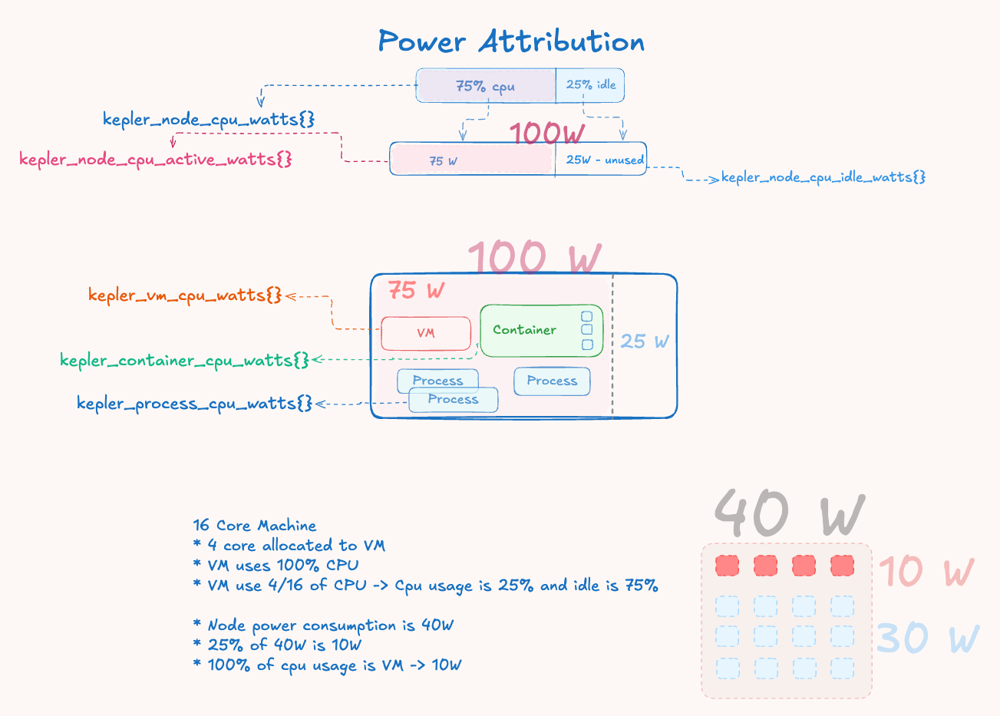

# Kepler Power Attribution Guide

This guide explains how Kepler measures and attributes power consumption to
processes, containers, VMs, and pods running on a system.

## Table of Contents

1. [Bird's Eye View](#birds-eye-view)
2. [Key Concepts](#key-concepts)
3. [Attribution Examples](#attribution-examples)
4. [Implementation Overview](#implementation-overview)
5. [Code Reference](#code-reference)
6. [Limitations and Considerations](#limitations-and-considerations)

## Bird's Eye View

### The Big Picture

Modern systems lack per-workload energy metering, providing only aggregate
power consumption at the hardware level. Kepler addresses this attribution
challenge through proportional distribution based on resource utilization:

1. **Hardware Energy Collection** - Intel RAPL sensors provide cumulative
   energy counters at package, core, DRAM, and uncore levels
2. **System Activity Analysis** - CPU utilization metrics from `/proc/stat`
   determine the ratio of active vs idle system operation
3. **Power Domain Separation** - Total energy is split into active power
   (proportional to workload activity) and idle power (baseline consumption)
4. **Proportional Attribution** - Active power is distributed to workloads
   based on their CPU time consumption ratios

### Core Philosophy

Kepler implements a **CPU-time-proportional energy attribution model** that
distributes hardware-measured energy consumption to individual workloads based
on their computational resource usage patterns.

The fundamental principle recognizes that system power consumption has two
distinct components:

- **Active Power**: Energy consumed by computational work, proportional to CPU
  utilization and scalable with workload activity
- **Idle Power**: Fixed baseline energy for maintaining system operation,
  including memory refresh, clock distribution, and idle core power states

### Attribution Formula

All workload types use the same proportional attribution formula:

```text
Workload Power = (Workload CPU Time Δ / Node CPU Time Δ) × Active Power
```

This ensures energy conservation - the sum of attributed power remains
proportional to measured hardware consumption while maintaining fairness based
on actual resource utilization.



*Figure 1: Power attribution flow showing how total measured power is
decomposed into active and idle components, with active power distributed
proportionally based on workload CPU time deltas.*

### Multi-Socket and Zone Aggregation

Modern server systems often feature multiple CPU sockets, each with their own
RAPL energy domains. Kepler handles this complexity through zone aggregation:

**Zone Types and Hierarchy:**

- **Package zones**: CPU socket-level energy (e.g., `package-0`, `package-1`)
- **Core zones**: Individual CPU core energy within each package
- **DRAM zones**: Memory controller energy per socket
- **Uncore zones**: Integrated GPU, cache, and interconnect energy
- **PSys zones**: Platform-level energy (most comprehensive when available)

**Aggregation Strategy:**

```text
Total Package Energy = Σ(Package-0 + Package-1 + ... + Package-N)
Total DRAM Energy = Σ(DRAM-0 + DRAM-1 + ... + DRAM-N)
```

**Counter Wraparound Handling:**
Each zone maintains independent energy counters that can wrap around at
different rates. The `AggregatedZone` implementation:

- Tracks last readings per individual zone
- Calculates deltas across wraparound boundaries using `MaxEnergy` values
- Aggregates deltas to provide system-wide energy consumption
- Maintains a unified counter that wraps at the combined `MaxEnergy` boundary

This ensures accurate energy accounting across heterogeneous multi-socket
systems while preserving the precision needed for power attribution
calculations.

## Key Concepts

### CPU Time Hierarchy

CPU time is calculated hierarchically for different workload types:

```text
Process CPU Time = Individual process CPU time from /proc/<pid>/stat
Container CPU Time = Σ(CPU time of all processes in the container)
Pod CPU Time = Σ(CPU time of all containers in the pod)
VM CPU Time = CPU time of the hypervisor process (e.g., QEMU/KVM)
Node CPU Time = Σ(All process CPU time deltas)
```

### Energy vs Power

- **Energy**: Measured in microjoules (μJ) as cumulative counters from hardware
- **Power**: Calculated as rate in microwatts (μW) using `Power = ΔEnergy / Δtime`

### Energy Zones

Hardware energy is read from different zones:

- **Package**: CPU package-level energy consumption
- **Core**: Individual CPU core energy
- **DRAM**: Memory subsystem energy
- **Uncore**: Integrated graphics and other uncore components
- **PSys**: Platform-level energy (most comprehensive when available)

### Independent Attribution

Each workload type (process, container, VM, pod) calculates power
**independently** based on its own CPU time usage. This means:

- Containers don't inherit power from their processes
- Pods don't inherit power from their containers
- VMs don't inherit power from their processes
- Each calculates directly from node active power

## Attribution Examples

### Example 1: Basic Power Split

**System State:**

- Hardware reports: 40W total system power
- Node CPU usage: 25% utilization ratio
- Power split: 40W × 25% = 10W active, 30W idle

**Workload Attribution:**
If a container used 20% of total node CPU time during the measurement
interval:

- **Container power** = (20% CPU usage) × 10W active = 2W

### Example 2: Multi-Workload Scenario

**System State:**

- Total power: 60W
- CPU usage ratio: 33.3% (1/3)
- Active power: 20W, Idle power: 40W
- Node total CPU time: 1000ms

**Process-Level CPU Usage:**

- Process 1 (standalone): 100ms CPU time
- Process 2 (in container-A): 80ms CPU time
- Process 3 (in container-A): 70ms CPU time
- Process 4 (in container-B): 60ms CPU time
- Process 5 (QEMU hypervisor): 200ms CPU time
- Process 6 (in container-C, pod-X): 90ms CPU time
- Process 7 (in container-D, pod-X): 110ms CPU time

**Hierarchical CPU Time Aggregation:**

- Container-A CPU time: 80ms + 70ms = 150ms
- Container-B CPU time: 60ms
- Container-C CPU time: 90ms (part of pod-X)
- Container-D CPU time: 110ms (part of pod-X)
- Pod-X CPU time: 90ms + 110ms = 200ms
- VM CPU time: 200ms (QEMU hypervisor process)

**Independent Power Attribution (each from node active power):**

- Process 1: (100ms / 1000ms) × 20W = 2W
- Process 2: (80ms / 1000ms) × 20W = 1.6W
- Process 3: (70ms / 1000ms) × 20W = 1.4W
- Process 4: (60ms / 1000ms) × 20W = 1.2W
- Process 5: (200ms / 1000ms) × 20W = 4W
- Process 6: (90ms / 1000ms) × 20W = 1.8W
- Process 7: (110ms / 1000ms) × 20W = 2.2W
- Container-A: (150ms / 1000ms) × 20W = 3W
- Container-B: (60ms / 1000ms) × 20W = 1.2W
- Container-C: (90ms / 1000ms) × 20W = 1.8W
- Container-D: (110ms / 1000ms) × 20W = 2.2W
- Pod-X: (200ms / 1000ms) × 20W = 4W
- VM: (200ms / 1000ms) × 20W = 4W

**Note:** Each workload type calculates power independently from node active power based on its own CPU time, not by inheriting from constituent workloads.

### Example 3: Container with Multiple Processes

**Container "web-server":**

- Process 1 (nginx): 100ms CPU time
- Process 2 (worker): 50ms CPU time
- Container total: 150ms CPU time

**If node total CPU time is 1000ms:**

- Container CPU ratio: 150ms / 1000ms = 15%
- Container power: 15% × active power

### Example 4: Pod with Multiple Containers

**Pod "frontend":**

- Container 1 (nginx): 200ms CPU time
- Container 2 (sidecar): 50ms CPU time
- Pod total: 250ms CPU time

**If node total CPU time is 1000ms:**

- Pod CPU ratio: 250ms / 1000ms = 25%
- Pod power: 25% × active power

## Implementation Overview

### Architecture Flow

```text
Hardware (RAPL) → Device Layer → Monitor (Attribution) → Exporters
    ↑                                ↑
/proc filesystem → Resource Layer ----┘
```

### Core Components

1. **Device Layer** (`internal/device/`): Reads energy from hardware sensors
2. **Resource Layer** (`internal/resource/`): Tracks processes/containers/VMs/ pods
   and calculates CPU time
3. **Monitor Layer** (`internal/monitor/`): Performs power attribution calculations
4. **Export Layer** (`internal/exporter/`): Exposes metrics via Prometheus/stdout

### Attribution Process

1. **Hardware Reading**: Device layer reads total energy from RAPL sensors
2. **CPU Time Calculation**: Resource layer aggregates CPU time hierarchically
3. **Node Power Split**: Monitor calculates active vs idle power based on CPU usage ratio
4. **Workload Attribution**: Each workload gets power proportional to its CPU time
5. **Energy Accumulation**: Energy totals accumulate over time for each workload
6. **Export**: Metrics are exposed for consumption

### Thread Safety

- **Device Layer**: Not required to be thread-safe (single monitor goroutine)
- **Resource Layer**: Not required to be thread-safe
- **Monitor Layer**: All public methods except `Init()` must be thread-safe
- **Singleflight Pattern**: Prevents redundant power calculations during
  concurrent requests

## Code Reference

### Key Files and Functions

#### Node Power Calculation

**File**: `internal/monitor/node.go`
**Function**: `calculateNodePower()`

```go
// Splits total hardware energy into active and idle components
activeEnergy = Energy(float64(deltaEnergy) * nodeCPUUsageRatio)
idleEnergy := deltaEnergy - activeEnergy
```

#### Process Power Attribution

**File**: `internal/monitor/process.go`
**Function**: `calculateProcessPower()`

```go
// Each process gets power proportional to its CPU usage
cpuTimeRatio := proc.CPUTimeDelta / nodeCPUTimeDelta
process.Power = Power(cpuTimeRatio * nodeZoneUsage.ActivePower.MicroWatts())
```

#### Container Power Attribution

**File**: `internal/monitor/container.go`
**Function**: `calculateContainerPower()`

```go
// Container CPU time = sum of all its processes
cpuTimeRatio := container.CPUTimeDelta / nodeCPUTimeDelta
container.Power = Power(cpuTimeRatio * nodeZoneUsage.ActivePower.MicroWatts())
```

#### VM Power Attribution

**File**: `internal/monitor/vm.go`
**Function**: `calculateVMPower()`

```go
// VM CPU time = hypervisor process CPU time
cpuTimeRatio := vm.CPUTimeDelta / nodeCPUTimeDelta
vm.Power = Power(cpuTimeRatio * nodeZoneUsage.ActivePower.MicroWatts())
```

#### Pod Power Attribution

**File**: `internal/monitor/pod.go`
**Function**: `calculatePodPower()`

```go
// Pod CPU time = sum of all its containers
cpuTimeRatio := pod.CPUTimeDelta / nodeCPUTimeDelta
pod.Power = Power(cpuTimeRatio * float64(nodeZoneUsage.ActivePower))
```

#### CPU Time Aggregation

**File**: `internal/resource/informer.go`
**Functions**: `updateContainerCache()`, `updatePodCache()`,
`updateVMCache()`

```go
// Container: Sum of process CPU times
cached.CPUTimeDelta += proc.CPUTimeDelta

// Pod: Sum of container CPU times
cached.CPUTimeDelta += container.CPUTimeDelta

// VM: Direct from hypervisor process
cached.CPUTimeDelta = proc.CPUTimeDelta
```

#### Wraparound Handling

**File**: `internal/monitor/node.go`
**Function**: `calculateEnergyDelta()`

```go
// Handles RAPL counter wraparound
func calculateEnergyDelta(current, previous, maxJoules Energy) Energy {
    if current >= previous {
        return current - previous
    }
    // Handle counter wraparound
    if maxJoules > 0 {
        return (maxJoules - previous) + current
    }
    return 0
}
```

### Data Structures

**File**: `internal/monitor/types.go`

```go
type Usage struct {
    Power       Power  // Current power consumption
    EnergyTotal Energy // Cumulative energy over time
}

type NodeUsage struct {
    EnergyTotal       Energy // Total absolute energy
    ActiveEnergyTotal Energy // Cumulative active energy
    IdleEnergyTotal   Energy // Cumulative idle energy
    Power             Power  // Total power
    ActivePower       Power  // Active power
    IdlePower         Power  // Idle power
}
```

## Limitations and Considerations

### CPU Power States and Attribution Accuracy

Modern CPUs implement sophisticated power management that affects attribution
accuracy beyond simple CPU time percentages:

#### C-States (CPU Sleep States)

- **C0 (Active)**: CPU executing instructions
- **C1 (Halt)**: CPU stopped but cache coherent
- **C2-C6+ (Deep Sleep)**: Progressively deeper sleep states
- **Impact**: Two processes with identical CPU time can have different power
  footprints based on sleep behavior

#### P-States (Performance States)

- **Dynamic Frequency Scaling**: CPU frequency adjusts based on workload
- **Voltage Scaling**: Power scales quadratically with voltage changes
- **Turbo Boost**: Short bursts of higher frequency
- **Impact**: High-frequency workloads consume disproportionately more power
  per CPU cycle

### Workload-Specific Characteristics

#### Compute vs Memory-Bound Workloads

```text
Example Scenario:
- Process A: 50% CPU, compute-intensive (high frequency, active execution)
- Process B: 50% CPU, memory-bound (frequent stalls, lower frequency)

Current Attribution: Both receive equal power
Reality: Process A likely consumes 2-3x more power
```

#### Instruction-Level Variations

- **Vector Instructions (AVX/SSE)**: 2-4x more power than scalar operations
- **Execution Units**: Different power profiles for integer vs floating point
- **Cache Behavior**: Cache misses trigger higher memory controller power

### Beyond CPU Attribution

#### Memory Subsystem

- **DRAM Power**: Memory-intensive workloads consume more DRAM power
- **Memory Controller**: Higher bandwidth increases uncore power
- **Cache Hierarchy**: Different access patterns affect cache power

#### I/O and Peripherals

- **Storage I/O**: Triggers storage controller and device power
- **Network I/O**: Consumes network interface and PCIe power
- **GPU Workloads**: Integrated graphics power not captured by CPU metrics

### Temporal Distribution Issues

#### Bursty vs Steady Workloads

```text
10-Second Window Example:
- Process A: Steady 20% CPU throughout interval
- Process B: 100% CPU for 2 seconds, idle for 8 seconds (20% average)

Current Attribution: Both receive equal power
Reality: Process B likely consumed more during its burst due to:
- Higher frequency scaling
- Thermal effects
- Different sleep state behavior
```

### When CPU Attribution Works Well

- **CPU-bound workloads** with similar instruction mixes
- **Steady-state workloads** without significant frequency scaling
- **Relative comparisons** between similar workload types
- **Trend analysis** over longer time periods

### When to Exercise Caution

- **Mixed workload environments** with varying compute vs I/O patterns
- **High-performance computing** workloads using specialized instructions
- **Absolute power budgeting** decisions based solely on Kepler metrics
- **Fine-grained optimization** requiring precise per-process power
  measurement

### Key Metrics

- `kepler_node_cpu_watts{}`: Total node power consumption
- `kepler_process_cpu_watts{}`: Individual process power
- `kepler_container_cpu_watts{}`: Container-level power
- `kepler_vm_cpu_watts{}`: Virtual machine power
- `kepler_pod_cpu_watts{}`: Kubernetes pod power

## Conclusion

Kepler's power attribution system provides practical, proportional distribution
of hardware energy consumption to individual workloads. While CPU-time-based
attribution has inherent limitations due to modern CPU complexity, it offers a
good balance between accuracy, simplicity, and performance overhead for most
monitoring and optimization use cases.

The implementation ensures energy conservation, fair proportional distribution,
and thread-safe concurrent access while minimizing the overhead of continuous
power monitoring. Understanding both the capabilities and limitations helps
users make informed decisions about when and how to rely on Kepler's power
attribution metrics.
