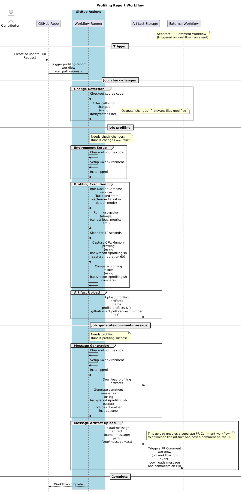

# 📊 Profiling Workflow

The Profiling workflow is an automated GitHub Actions workflow that generates and compares performance profiles for Kepler when changes are made to the codebase. This workflow helps developers understand the performance impact of their changes by providing detailed CPU and memory profiling data.

## 🎯 Purpose

The profiling workflow serves several critical purposes:

1. **📉 Performance Regression Detection**: Automatically identifies potential performance degradations introduced by code changes
2. **📈 Resource Usage Analysis**: Provides detailed insights into CPU and memory consumption patterns
3. **⚖️ Comparative Analysis**: Compares performance metrics between the development version and the latest stable version
4. **🔄 Continuous Performance Monitoring**: Ensures performance considerations are part of the development process

## 🔄 Workflow Overview

## 🏗️ Workflow Structure

The profiling workflow consists of three main jobs:

### 1. 🔍 Check Changes Job

- **🎯 Purpose**: Determines if profiling should run based on file changes
- **⚡ Trigger**: Runs on every pull request

### 2. 📊 Profiling Job

- **🎯 Purpose**: Executes the actual profiling process
- **⚠️ Conditions**: Only runs if relevant changes are detected

### 3. 💬 Generate Comment Message Job

- **🎯 Purpose**: Creates a formatted comment message with profiling results
- **⚠️ Conditions**: Only runs if profiling job succeeds
- **📦 Output**: Generates artifacts containing:
  - Formatted profiling comparison results
  - Download instructions for profiling artifacts
  - GitHub CLI commands for artifact retrieval

## ✨ Key Features

### 🤖 Automated Environment Setup

The workflow automatically provisions a complete testing environment including:

- 🐳 Docker containerization for isolated testing
- 🔄 Both development and production Kepler versions

### 🔬 Comprehensive Profiling

- **⏱️ Duration**: 60-second profiling sessions for statistically significant data
- **📊 Metrics**: CPU and memory usage patterns
- **🔀 Comparison**: Side-by-side analysis of different versions

### 📦 Artifact Management

- **🗓️ Retention**: Profiling artifacts retained for 5 days
- **🏷️ Naming**: Artifacts named with PR numbers for easy identification
- **📥 Access**: Multiple download methods provided (web interface, GitHub CLI)

## 🔐 Security Considerations

### 🤔 Why Separate Comment Message Generation?

The workflow uploads comment messages as artifacts rather than directly posting comments to pull requests. This approach addresses critical security concerns outlined in [issue #2287](https://github.com/sustainable-computing-io/kepler/issues/2287).

### ⚠️ Security Challenge

Using the `pull_request_target` event for PR comments creates security risks because:

- ⚡ The workflow runs in the context of the target branch with full repository permissions
- 🛡️ Malicious code in PR branches could potentially access sensitive information
- 🔓 Direct comment posting from PR contexts poses privilege escalation risks

### ✅ Secure Solution

The current approach implements a two-stage security model:

1. **🔄 Source Workflow** (this profiling workflow):
   - 🔒 Runs in the limited context of the PR branch
   - 🛡️ Generates comment content safely
   - 📤 Uploads message as an artifact (no direct repository access)

2. **💬 Dedicated PR Comment Workflow**:
   - 🔐 Runs separately using the safer `workflow_run` event trigger
   - 📥 Downloads the pre-generated comment artifact
   - 📝 Posts comments with proper base branch context
   - 🛡️ Maintains security isolation

### 🎯 Benefits of This Approach

- **🔐 Security Isolation**: PR comment workflows run in base branch context, not PR context
- **🛡️ Reduced Attack Surface**: Limited permissions for content generation workflows
- **📋 Audit Trail**: Clear separation of content generation and posting actions
- **♻️ Reusability**: Comment generation pattern can be reused across multiple workflows

## 🚀 Usage

The profiling workflow automatically triggers on pull requests that modify relevant files. No manual intervention is required. Results are available through:

1. **📊 GitHub Actions Summary**: View workflow execution details and download artifacts
2. **💬 PR Comments**: Automated comments with profiling summaries (posted by separate workflow)
3. **📦 Artifacts**: Detailed profiling data available for download and local analysis
