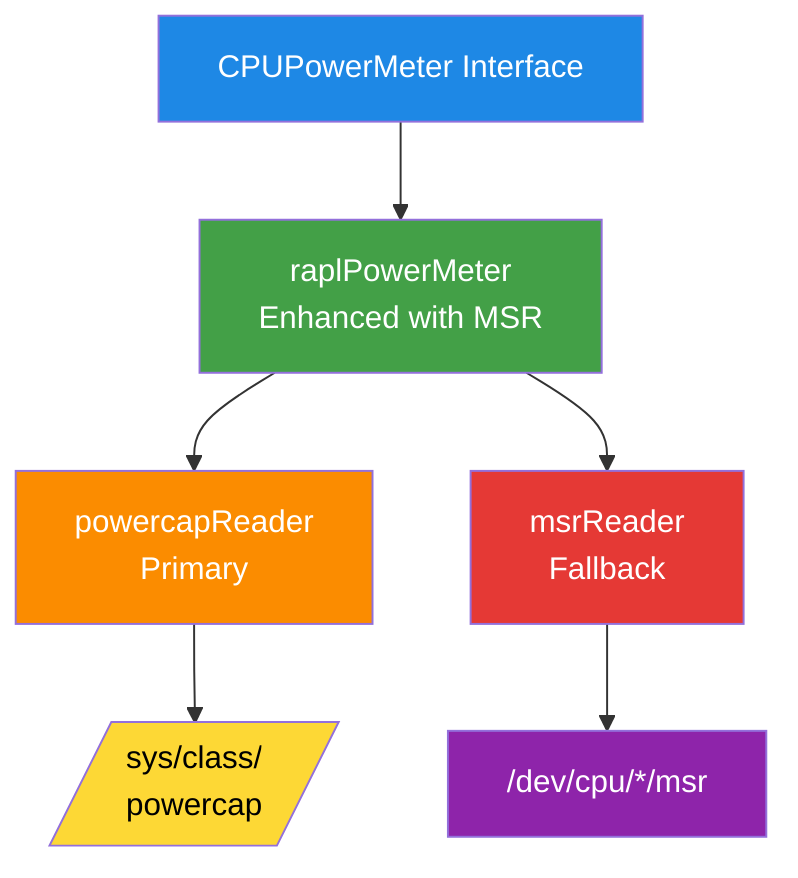

# EP-002: MSR Fallback for CPU Power Meter

* **Status**: Draft
* **Author**: Sunil Thaha
* **Created**: 2025-08-13

## Problem

Kepler fails when `/sys/class/powercap/intel-rapl` is unavailable (disabled
kernels, restricted containers). Users have reported scenarios where MSR
access is available but powercap is disabled or inaccessible (see issue [#2262](https://github.com/sustainable-computing-io/kepler/issues/2262)).

## Goals

* Implement MSR-based RAPL reading as automatic fallback, when opted-in/configured, when powercap is
  unavailable
* Maintain existing CPUPowerMeter interface compatibility
* Provide configurable control over fallback behavior for security-conscious
  deployments

## Solution

Add MSR as fallback to read RAPL energy counters directly from CPU registers. This solution will support multi-socket CPUs by reading energy values from each CPU/socket.

## Proposed Solution



## Implementation

### 1. Create abstraction

```go
type raplReader interface {
    // Zones returns the list of energy zones available from this reader
    Zones() ([]EnergyZone, error)

    // Available checks if the reader can be used on the current system
    Available() bool

    // Init initializes the reader and verifies it can read energy values
    Init() error

    // Close releases any resources held by the reader
    Close() error

    // Name returns a human-readable name for the reader implementation
    Name() string
}
```

### 2. Refactor existing code

* Extract current powercap logic → `powercapReader`
* Add `msrReader` for `/dev/cpu/*/msr` access
* Auto-detect in `raplPowerMeter.Init()` with configurable fallback behavior

### 3. MSR registers

* UNIT: 0x606 (IA32_RAPL_POWER_UNIT - contains energy unit scaling factor)
* PKG: 0x611 (MSR_PKG_ENERGY_STATUS - package energy counter)
* PP0: 0x639 (MSR_PP0_ENERGY_STATUS - core/Power Plane 0 energy counter)
* DRAM: 0x619 (MSR_DRAM_ENERGY_STATUS - memory energy counter)
* UNCORE: 0x641 (MSR_PP1_ENERGY_STATUS - uncore/Power Plane 1 energy counter)

Note: Energy counters are 32-bit values that wrap around at ~4.29 billion units.
The energy unit from register 0x606 (bits 12:8) is used to convert raw counter
values to microjoules.

## Configuration

```yaml
device:
  msr:
    enabled: false  # opt-in due to security (defaults to false)
    force: false    # force MSR even if powercap available (testing only)
    devicePath: /dev/cpu  # MSR base device path (mounted as host/dev/cpu in containers)
```

CLI flags will not be exposed for MSR settings to avoid accidental enabling
of this security-sensitive feature.

## Security

MSR access enables PLATYPUS attacks (CVE-2020-8694/8695). Will be disabled by
default and require CAP_SYS_RAWIO capability. A security warning will be logged
when MSR fallback is activated.

## Testing

* Mock MSR files for unit testing
* Integration tests for fallback behavior
* Maintain existing test coverage

## Metrics

```prometheus
# New metric indicating active power meter backend
kepler_node_cpu_power_meter{source="rapl-powercap|rapl-msr"} 1

# Existing metrics remain unchanged and won't have "source" label
kepler_node_cpu_joules_total{zone="package|core|dram"}
kepler_node_cpu_watts{zone="package|core|dram"}
kepler_node_cpu_active_joules_total{zone="package|core|dram"}
kepler_node_cpu_idle_joules_total{zone="package|core|dram"}
```

## Compatibility

* No API changes
* Powercap remains primary
* Existing deployments unaffected
