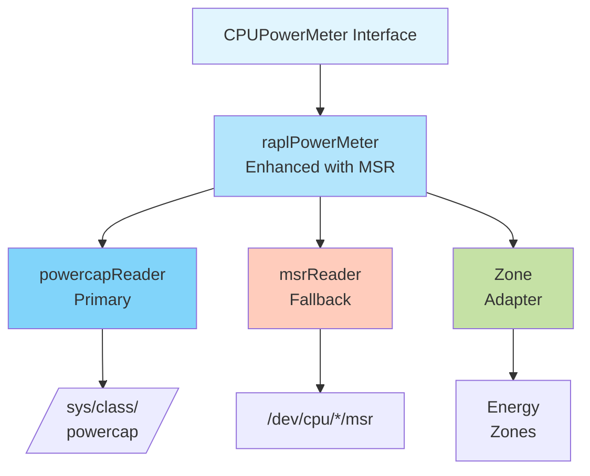

# EP-002: MSR Fallback for CPU Power Meter

**Status**: Draft
**Author**: Kepler Development Team
**Created**: 2025-01-12
**Last Updated**: 2025-01-12

## Summary

This proposal introduces MSR (Model Specific Register) support as a fallback
mechanism for CPU power monitoring in Kepler when the primary powercap sysfs
interface (/sys/class/powercap/intel-rapl) is unavailable. The enhancement
maintains backward compatibility while improving Kepler's resilience in
environments where powercap is disabled or inaccessible, such as certain
container runtimes or kernel configurations.

## Problem Statement

Kepler currently relies exclusively on the Linux powercap sysfs interface for
reading Intel RAPL energy counters. This creates deployment limitations in
environments where:

1. The powercap interface is disabled by kernel configuration
2. Container runtimes don't expose /sys/class/powercap
3. Systems with custom kernel builds lacking powercap support
4. Virtualized environments without powercap passthrough

These limitations prevent Kepler from collecting energy metrics in otherwise
capable hardware, reducing its effectiveness as a universal energy monitoring
solution.

### Current Limitations

1. **Single Interface Dependency**: Complete reliance on powercap sysfs with no
   fallback mechanism
2. **Deployment Restrictions**: Cannot deploy in environments without powercap
   access
3. **Container Limitations**: Difficulty mounting /sys/class/powercap in certain
   container security policies
4. **No Graceful Degradation**: Complete failure rather than fallback when
   powercap unavailable

## Goals

- **Primary Goal**: Implement MSR-based RAPL reading as automatic fallback when
  powercap is unavailable
- **Secondary Goal**: Maintain existing CPUPowerMeter interface compatibility
- **Tertiary Goal**: Provide configurable control over fallback behavior for
  security-conscious deployments

## Non-Goals

- Supporting non-Intel architectures (AMD RAPL, ARM PMU)
- Replacing powercap as the primary interface
- Implementing model-specific optimizations
- Supporting pre-Sandy Bridge Intel CPUs
- Real-time power capping functionality

## Requirements

### Functional Requirements

- Automatically detect powercap availability and fallback to MSR when needed
- Read energy values from MSR registers: PKG (0x611), PP0 (0x639), DRAM (0x619)
- Handle 32-bit MSR counter overflow correctly
- Map MSR zones to existing EnergyZone interface (package, core, dram)
- Support multi-socket systems with per-CPU MSR access
- Maintain energy unit conversion compatibility

### Non-Functional Requirements

- **Performance**: MSR reading overhead < 100μs per sample
- **Reliability**: Handle MSR module loading/unloading gracefully
- **Security**: Document and mitigate PLATYPUS attack vectors
- **Maintainability**: Minimal code duplication with existing RAPL implementation
- **Testability**: Support fake MSR implementation for testing

## Proposed Solution

### High-Level Architecture



### Key Design Choices

1. **Extend Existing Implementation**: Enhance `raplPowerMeter` rather than
   creating separate implementation to maximize code reuse
2. **Interface-Based Abstraction**: Create `powerReader` interface for both
   powercap and MSR backends
3. **Automatic Detection**: Check powercap availability in Init() and select
   appropriate backend
4. **Opt-In MSR Fallback**: Require explicit configuration to enable MSR due to
   security implications
5. **Reuse Energy Zone Logic**: Share zone management between implementations

## Detailed Design

### Package Structure

```text
internal/
├── device/
│   ├── cpu_power_meter.go          # Interface (unchanged)
│   ├── rapl_power_meter.go         # Enhanced with MSR support
│   ├── power_reader.go             # New abstraction interface
│   ├── powercap_reader.go          # Extracted powercap logic
│   ├── msr_reader.go               # New MSR implementation
│   ├── msr_reader_test.go          # MSR unit tests
│   └── testdata/
│       └── msr/                    # MSR test fixtures
└── config/
    └── config.go                   # MSR configuration options
```

### API/Interface Changes

```go
// power_reader.go - New internal abstraction
type powerReader interface {
    // ReadEnergy reads energy value for a specific zone
    ReadEnergy(zone EnergyZone) (Energy, error)
    // Available checks if the reader can be used
    Available() bool
    // Init initializes the reader
    Init() error
    // Close releases resources
    Close() error
}

// msr_reader.go - MSR implementation
type msrReader struct {
    msrFiles   map[int]*os.File  // CPU ID -> MSR file handle
    energyUnit float64            // Energy unit from IA32_RAPL_POWER_UNIT
    zones      []EnergyZone       // Available zones
    mu         sync.RWMutex       // Thread safety
}

// Enhanced rapl_power_meter.go
type raplPowerMeter struct {
    reader     powerReader        // Abstracted backend
    zones      []EnergyZone
    strategy   EnergyStrategy
    useMSR     bool              // Track which backend is active
}
```

## Configuration

### Main Configuration Changes

```go
// config/config.go additions
type DeviceConfig struct {
    // Existing fields...
    MSR MSRConfig `yaml:"msr"`
}

type MSRConfig struct {
    // Enable automatic MSR fallback when powercap unavailable
    Enabled *bool `yaml:"enabled"`
    // Force MSR usage even if powercap available (testing)
    Force *bool `yaml:"force"`
    // MSR device path template
    DevicePath string `yaml:"devicePath"`
}

// Default configuration
func defaultMSRConfig() MSRConfig {
    return MSRConfig{
        Enabled:    ptr(false),  // Opt-in for security
        Force:      ptr(false),
        DevicePath: "/dev/cpu/%d/msr",
    }
}
```

### New Configuration File (if applicable)

```yaml
# Example: hack/config.yaml
msr:
  enabled: true
  force: false
  devicePath: "/dev/cpu/%d/msr"
```

### Security Considerations

**Critical Security Warning**: MSR access enables PLATYPUS side-channel attacks
(CVE-2020-8694/8695) allowing unprivileged users to infer data from other
processes.

**Mitigations**:

1. MSR fallback disabled by default (opt-in configuration)
2. Require CAP_SYS_RAWIO capability instead of full root
3. Document security implications prominently
4. Add warning logs when MSR fallback is activated
5. Consider rate-limiting MSR reads to reduce attack surface

## Deployment Examples

### Kubernetes Environment

```yaml
# DaemonSet with MSR support
apiVersion: apps/v1
kind: DaemonSet
metadata:
  name: kepler
spec:
  template:
    spec:
      containers:
      - name: kepler
        image: kepler:msr-enabled
        args:
        - --config=/etc/kepler/config.yaml
        volumeMounts:
        - name: dev
          mountPath: /dev
          readOnly: true
        - name: config
          mountPath: /etc/kepler
        securityContext:
          privileged: true  # Required for MSR access
      volumes:
      - name: dev
        hostPath:
          path: /dev
      - name: config
        configMap:
          name: kepler-config
---
apiVersion: v1
kind: ConfigMap
metadata:
  name: kepler-config
data:
  config.yaml: |
    msr:
      enabled: true
```

### Standalone Deployment

```bash
# Load MSR kernel module
sudo modprobe msr

# Run with MSR fallback enabled
sudo ./bin/kepler --config hack/config.yaml

# Force MSR for testing (ignores powercap) - configured via YAML only
# Set msr.force: true in config file
```

## Testing Strategy

### Test Coverage

- **Unit Tests**: MSR reader with mock file operations (85% coverage target)
- **Integration Tests**: Fallback detection and switching logic
- **End-to-End Tests**: Energy attribution with MSR backend
- **Benchmark Tests**: MSR vs sysfs performance comparison

### Test Infrastructure

```go
// Fake MSR implementation for testing
type fakeMSRReader struct {
    energyValues map[EnergyZone]Energy
    available    bool
}

// Test fixtures in testdata/msr/
// - Mock MSR device files
// - Predefined energy values
// - Overflow scenarios
```

## Migration and Compatibility

### Backward Compatibility

This enhancement maintains full backward compatibility:

- Existing deployments continue using powercap by default
- No changes to external APIs or metrics
- Configuration changes are additive only
- Existing tests remain valid

### Migration Path

1. **Phase 1**: Deploy with MSR disabled (default) - verify no regression
2. **Phase 2**: Enable MSR fallback in staging environments
3. **Phase 3**: Gradual rollout to production with monitoring

### Rollback Strategy

1. Disable MSR fallback via configuration (immediate effect)
2. Revert to previous Kepler version if issues persist
3. MSR can be disabled without restart via dynamic config reload

## Metrics Output

```prometheus
# New metric indicating active power meter backend
kepler_power_meter_backend{backend="powercap|msr"} 1

# Existing metrics unchanged
kepler_node_package_energy_millijoule{node="node1"} 12345
kepler_node_core_energy_millijoule{node="node1"} 6789
kepler_node_dram_energy_millijoule{node="node1"} 3456
```

## Implementation Plan

### Phase 1: Foundation (Week 1-2)

- Implement `powerReader` interface abstraction
- Extract existing powercap logic to `powercapReader`
- Create basic `msrReader` structure
- Add MSR configuration options

### Phase 2: Core Functionality (Week 3-4)

- Implement MSR register reading logic
- Add energy unit conversion
- Handle counter overflow
- Implement zone mapping
- Add fallback detection logic

### Phase 3: Testing and Documentation (Week 5-6)

- Comprehensive unit tests
- Integration testing
- Performance benchmarking
- Security documentation
- Update deployment guides

## Risks and Mitigations

### Technical Risks

- **Risk**: MSR kernel module not available
  - **Mitigation**: Graceful degradation with clear error messages

- **Risk**: MSR counter overflow handling errors
  - **Mitigation**: Extensive testing with overflow scenarios

- **Risk**: Performance regression from abstraction
  - **Mitigation**: Benchmark and optimize hot paths

### Operational Risks

- **Risk**: Security vulnerabilities from MSR access
  - **Mitigation**: Disabled by default, clear documentation

- **Risk**: Increased complexity for operators
  - **Mitigation**: Automatic detection minimizes configuration

## Alternatives Considered

### Alternative 1: Separate MSR Power Meter Implementation

- **Description**: Create independent `msrPowerMeter` implementing
  `CPUPowerMeter`
- **Reason for Rejection**: High code duplication, difficult to maintain
  consistency

### Alternative 2: eBPF-based Power Monitoring

- **Description**: Use eBPF to intercept RAPL MSR reads from other processes
- **Reason for Rejection**: Complex implementation, limited kernel support,
  security concerns

### Alternative 3: Intel Power Gadget Integration

- **Description**: Use Intel's official Power Gadget API
- **Reason for Rejection**: Not available on Linux, requires proprietary
  libraries

## Success Metrics

- **Functional Metric**: Successfully read power through MSR in environments where
  powercap is unavailable
- **Performance Metric**: MSR reading overhead < 100μs (50% faster than powercap)
- **Adoption Metric**: 20% of deployments utilize MSR fallback within 6 months

## Open Questions

1. Should we support AMD's RAPL MSRs in the same implementation?
2. Should MSR support be compiled conditionally for security-sensitive builds?
3. What telemetry should we add to track MSR fallback usage in production?
