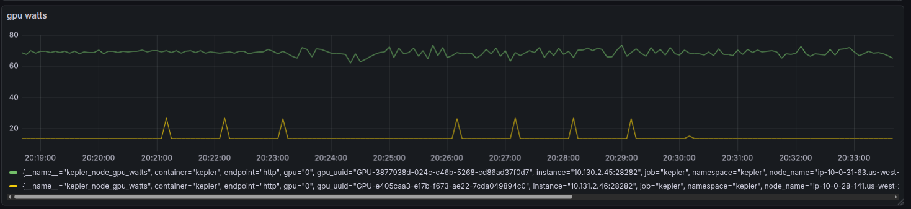
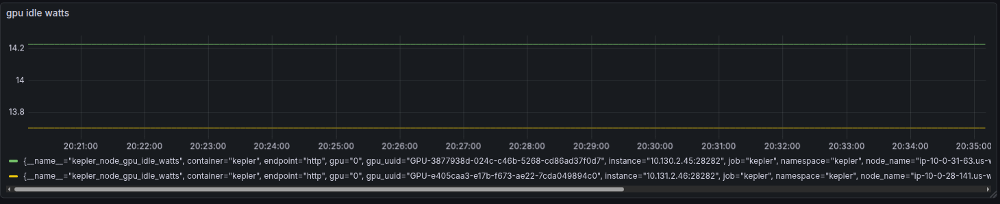

# EP-003: GPU Power Monitoring

- **Status**: Draft (Reference Implementation Available)
- **Maturity**: Experimental
- **Author**: Vimal Kumar
- **Created**: 2025-12-10

## Summary

Add GPU power monitoring to Kepler with a vendor-agnostic architecture supporting NVIDIA, AMD, and Intel GPUs. The implementation uses a pluggable backend system with automatic discovery, per-process energy attribution based on compute utilization, and Kubernetes-native GPU device mapping via the kubelet pod-resources API.

## Problem

Kepler currently measures only CPU power via Intel RAPL, missing:

- GPU power consumption (significant in ML/AI workloads, often 200-400W per device)
- Multi-vendor GPU support (NVIDIA, AMD, Intel)
- Process-level GPU energy attribution for container/pod billing
- GPU idle vs active power separation

### Current Limitations

1. No GPU power metrics despite GPUs being major power consumers in modern workloads
2. Cannot attribute GPU energy to specific containers/pods for chargeback
3. No visibility into GPU utilization patterns affecting power consumption

## Goals

- **Primary**: Add GPU power monitoring with vendor-agnostic architecture
- **Secondary**: Support per-process energy attribution by compute utilization
- **Tertiary**: Enable Kubernetes GPU allocation mapping for pod-level metrics

## Non-Goals

- Power capping or GPU frequency management
- GPU memory bandwidth power modeling
- Training workload-specific optimizations
- Real-time (sub-second) GPU power monitoring

## Solution

Add a pluggable GPU backend system with automatic discovery, integrated into the existing PowerMonitor architecture.

```text
┌─────────────────────────────────────────────────────────────────┐
│                         PowerMonitor                            │
│  ┌─────────────┐    ┌──────────────┐    ┌───────────────────┐   │
│  │ CPUCollector│    │ GPUCollector │    │ ResourceInformer  │   │
│  └──────┬──────┘    └──────┬───────┘    └─────────┬─────────┘   │
│         │                  │                      │             │
└─────────┼──────────────────┼──────────────────────┼─────────────┘
          │                  │                      │
          ▼                  ▼                      ▼
   ┌──────────┐    ┌──────────────────────────┐    ┌─────────────────┐
   │RAPL/MSR  │    │     GPU Registry         │    │ Kubelet API     │
   └──────────┘    │  ┌────────────────────┐  │    │ (pod-resources) │
                   │  │      NVIDIA        │  │    └─────────────────┘
                   │  │ ┌───────┬────────┐ │  │
                   │  │ │ NVML  │ DCGM   │ │  │
                   │  │ │       │Exporter│ │  │
                   │  │ └───────┴────────┘ │  │
                   │  ├────────────────────┤  │
                   │  │   AMD (ROCm SMI)   │  │
                   │  ├────────────────────┤  │
                   │  │  Intel (Level0)    │  │
                   │  └────────────────────┘  │
                   └──────────────────────────┘
```

For NVIDIA GPUs, the implementation uses:

- **NVML**: Power readings, device enumeration, process PIDs, MIG topology
- **dcgm-exporter**: MIG instance activity metrics (via HTTP)

## Implementation

### Package Structure

```text
internal/device/gpu/
├── interface.go          # GPUPowerMeter interface, GPUDevice, ProcessGPUInfo
├── types.go              # Vendor, SharingMode, ComputeMode, error types
├── registry.go           # Register(), DiscoverAll()
├── nvidia/
│   ├── collector.go      # GPUPowerCollector - main implementation
│   ├── nvml.go           # NVML wrapper (go-nvml bindings)
│   ├── dcgm_exporter.go  # HTTP client for dcgm-exporter (MIG support)
│   ├── detector.go       # GPU sharing mode detection
│   └── mig_types.go      # MIG-specific types and interfaces
├── amd/                  # [future] ROCm SMI backend
└── intel/                # [future] Level Zero backend
```

**Note:** `amd/` and `intel/` directories are planned for future multi-vendor support.

### Core Interface

```go
// Vendor identifies the GPU manufacturer (in types.go)
type Vendor string

const (
    VendorNVIDIA  Vendor = "nvidia"
    VendorAMD     Vendor = "amd"
    VendorIntel   Vendor = "intel"
    VendorUnknown Vendor = "unknown"   // Sentinel value - unknown vendors are logged and skipped
)

// SharingMode represents how a GPU is shared among processes (in types.go)
type SharingMode int

const (
    SharingModeUnknown SharingMode = iota
    SharingModeExclusive    // Single process, 100% attribution
    SharingModeTimeSlicing  // Multiple processes, SM% attribution
    SharingModeMIG          // MIG partitions, activity-based attribution
)

// GPUDevice represents a single GPU device (in interface.go)
type GPUDevice struct {
    Index  int     // Device index (0, 1, 2...)
    UUID   string  // Globally unique identifier
    Name   string  // Human-readable name (e.g., "NVIDIA A100")
    Vendor Vendor
    K8sResourceName string // e.g., "nvidia.com/gpu", "amd.com/gpu"
}

// ProcessGPUInfo contains per-process GPU metrics (in interface.go)
type ProcessGPUInfo struct {
    PID         uint32
    DeviceIndex int
    DeviceUUID  string
    ComputeUtil float64   // 0.0-1.0 (SM% for NVIDIA)
    MemoryUsed  uint64    // bytes
    Timestamp   time.Time
}

// GPUPowerStats contains power statistics for a GPU device
type GPUPowerStats struct {
    TotalPower  float64 // Current total power in Watts
    IdlePower   float64 // Detected/configured idle power in Watts
    ActivePower float64 // Active power (Total - Idle) in Watts
}

// GPUPowerMeter is the vendor-agnostic interface for GPU power monitoring
type GPUPowerMeter interface {
    service.Service     // Name()
    service.Initializer // Init()
    service.Shutdowner  // Shutdown()

    Vendor() Vendor
    Devices() []GPUDevice
    GetPowerUsage(deviceIndex int) (device.Power, error)
    GetTotalEnergy(deviceIndex int) (device.Energy, error)
    GetDevicePowerStats(deviceIndex int) (GPUPowerStats, error)
    GetProcessPower() (map[uint32]float64, error)  // PID -> watts
    GetProcessInfo() ([]ProcessGPUInfo, error)
}
```

### Registry Pattern

The registry pattern enables automatic discovery of available GPU backends at runtime.
Each vendor backend registers itself, and `DiscoverAll()` probes for available hardware:

```go
// registry.go
var registry = make(map[Vendor]Factory)

func Register(vendor Vendor, factory Factory) {
    registry[vendor] = factory
}

func DiscoverAll(logger *slog.Logger) []GPUPowerMeter {
    var meters []GPUPowerMeter
    for vendor, factory := range registry {
        meter, err := factory(logger)
        if err != nil { continue }
        if err := meter.Init(); err != nil { continue }
        if len(meter.Devices()) == 0 { continue }
        meters = append(meters, meter)
    }
    return meters
}
```

GPU vendor support is detected at runtime based on available hardware and drivers.
No compile-time build tags are required.

### Energy Attribution

GPU power is attributed to processes proportionally by compute utilization:

```text
active_power = total_power - idle_power
process_power = active_power × (process_compute_util / total_compute_util)
process_energy = process_power × collection_interval
```

**Example:**

- Node GPU power: 65W
- Idle power: 17W (auto-detected)
- Active power: 65W - 17W = 48W
- Process A compute util: 85%
- Process A power: 48W × 0.85 = 40.8W

### Idle Power Detection

Idle power is the baseline power a GPU consumes when no workloads are running. It must be subtracted before attributing power to processes.

**Auto-detection (default):**

```go
// Track minimum observed power - only decreases, never increases
if powerWatts < c.minObservedPower[device.UUID] {
    c.minObservedPower[device.UUID] = powerWatts
}
idlePower := c.minObservedPower[device.UUID]
```

- Tracks minimum observed power over time
- Converges to true idle as GPU occasionally goes fully idle
- **Limitation**: If GPU never fully idles, detected idle may be higher than actual

**Configured override:**

```go
// Set fixed idle power for all GPUs
monitor.WithGPUIdlePower(17.0)  // watts
```

Use when:

- GPU never idles (always has background workloads)
- Known idle power from GPU specifications (e.g., Tesla T4 idle ~15-20W)

**Future: Config file option (not yet implemented):**

```yaml
gpu:
  idlePower: 17.0  # watts - applies to all GPUs
  # Or per-device:
  devices:
    GPU-3877938d-024c-c46b-5268-cd86ad37f0d7:
      idlePower: 15.0
```

**Idle power behavior:**

- Idle power stays at node level (`kepler_node_gpu_idle_watts`)
- NOT attributed to any process
- Only active power (total - idle) is divided among processes

### GPU Sharing Modes

GPUs can be shared across workloads in different ways. This implementation handles each mode differently:

| Mode             | Description                                 | Per-Process Attribution                   | Supported |
|------------------|---------------------------------------------|-------------------------------------------|-----------|
| **Exclusive**    | One pod per GPU                             | Trivial (100% to single process)          | ✓         |
| **Time-slicing** | Multiple pods share GPU via time-division   | ✓ via SM utilization %                    | ✓         |
| **MIG**          | GPU partitioned into isolated instances     | Each partition appears as separate device | ✓         |
| **MPS**          | Multiple processes share GPU simultaneously | Limited (shared context)                  | Partial   |

**Exclusive mode:**

One pod has exclusive access to the GPU. Attribution is trivial - all power goes to that pod. This mode doesn't require the utilization-based attribution logic.

**Time-slicing (primary use case):**

Multiple pods share a single GPU via time-slicing enabled by the NVIDIA device plugin. The GPU driver rapidly context-switches between processes. NVML reports:

- Total GPU power (single value for the device)
- Per-process compute utilization (SM%)

We attribute power proportionally by SM utilization:

```text
process_power = active_power × (process_sm_util / total_sm_util)
```

This is the scenario that motivated the entire implementation - without per-process attribution, we'd have no way to bill individual pods on a shared GPU.

**MIG (Multi-Instance GPU):**

NVIDIA MIG partitions a physical GPU into isolated instances, each with dedicated compute and memory. MIG presents unique challenges for power monitoring:

1. **NVML utilization queries return "N/A"** - The standard `nvmlDeviceGetUtilizationRates()` API doesn't work at the MIG instance level
2. **Power is only reported at board level** - NVML reports total GPU power, not per-MIG-instance power
3. **Multiple processes share the physical GPU** - Each MIG instance runs independent workloads needing separate power attribution

#### Hybrid NVML + dcgm-exporter Approach

We use NVML for static MIG topology and process enumeration, combined with dcgm-exporter for activity metrics:

- **MIG hierarchy from NVML**: Enumerate all MIG instances at startup using `nvmlDeviceGetMigDeviceHandleByIndex()`. This is static configuration.
- **Activity from dcgm-exporter**: Query the `DCGM_FI_PROF_GR_ENGINE_ACTIVE` metric via HTTP. This field measures the fraction of time (0.0-1.0) that the compute engine was active.
- **Process PIDs from NVML**: Get running processes within each MIG instance using standard NVML process APIs.

**Why dcgm-exporter HTTP (not go-dcgm library):**

- The `go-dcgm` library requires `libdcgm.so.4` at runtime, which is only available inside DCGM container images (not on host filesystem)
- Redistributing DCGM binaries would conflict with NVIDIA's licensing terms
- dcgm-exporter is already deployed by NVIDIA GPU Operator as a DaemonSet - we simply query its `/metrics` endpoint

**Power attribution formula for MIG:**

```text
P_process = P_active × (activity_i / Σactivity)

Where:
  P_active = P_total - P_idle
  activity_i = DCGM_FI_PROF_GR_ENGINE_ACTIVE for MIG instance i
```

For detailed MIG implementation design, see [MIG Power Attribution Design](./mig-power-attribution.md).

**MPS (Multi-Process Service):**

CUDA MPS allows multiple processes to share GPU context simultaneously (not time-sliced). This is problematic:

- Processes share SM resources concurrently
- NVML may not report accurate per-process utilization
- Attribution accuracy is reduced

MPS is less common in Kubernetes environments and not a priority for this implementation.

### Kubernetes Integration

GPU-to-Pod mapping via kubelet pod-resources API.

**The problem:** NVML gives us GPU metrics by device index and process PID, but we need to know which **pod** owns that GPU for Kubernetes-level metrics.

**Solution:** The kubelet exposes `/var/lib/kubelet/pod-resources/kubelet.sock` which maps GPU device UUIDs to pods. We query this API to correlate:

1. NVML reports: "PID 12345 uses GPU-abc123 at 85% SM"
2. Resource informer: "PID 12345 runs in container xyz"
3. Pod-resources API: "GPU-abc123 belongs to pod ml-training"
4. Result: `kepler_pod_gpu_watts{pod_name="ml-training"} 42.3`

```go
// Known GPU device plugin resource names
var GPUResourceNames = map[string]bool{
    "nvidia.com/gpu":     true,
    "amd.com/gpu":        true,
    "intel.com/gpu":      true,
    "gpu.intel.com/i915": true,
}

// GPUAllocationInformer queries kubelet for GPU allocations
type GPUAllocationInformer struct {
    client podresourcesapi.PodResourcesListerClient
    // ...
}

func (i *GPUAllocationInformer) GetAllocations() (*GPUAllocations, error) {
    resp, _ := i.client.List(ctx, &podresourcesapi.ListPodResourcesRequest{})
    // Filter for GPU resources, index by device UUID
}
```

## Metrics

### Node GPU Metrics

#### kepler_node_gpu_info

- **Type**: GAUGE
- **Description**: GPU device information for mapping index to UUID/name
- **Labels**:
  - `gpu` - Device index (0, 1, 2...)
  - `gpu_uuid` - Globally unique identifier (e.g., "GPU-3877938d-024c-c46b-5268-cd86ad37f0d7")
  - `gpu_name` - Human-readable name (e.g., "Tesla T4", "NVIDIA A100-SXM4-40GB")
  - `vendor` - GPU vendor (nvidia, amd, intel)
- **Constant Labels**:
  - `node_name`

#### kepler_node_gpu_joules_total

- **Type**: COUNTER
- **Description**: Total energy consumption of GPU at node level in joules
- **Labels**:
  - `gpu`
  - `gpu_uuid`
  - `vendor`
- **Constant Labels**:
  - `node_name`

#### kepler_node_gpu_watts

- **Type**: GAUGE
- **Description**: Total power consumption of GPU at node level in watts
- **Labels**:
  - `gpu`
  - `gpu_uuid`
  - `vendor`
- **Constant Labels**:
  - `node_name`

#### kepler_node_gpu_idle_watts

- **Type**: GAUGE
- **Description**: Idle power consumption of GPU at node level in watts (auto-detected minimum)
- **Labels**:
  - `gpu`
  - `gpu_uuid`
  - `vendor`
- **Constant Labels**:
  - `node_name`

### Process GPU Metrics

#### kepler_process_gpu_joules_total

- **Type**: COUNTER
- **Description**: Total energy consumption attributed to process on GPU in joules
- **Labels**:
  - `pid` - Process ID
  - `comm` - Process command name
  - `gpu` - Device index
  - `vendor` - GPU vendor
  - `state` - running/terminated
  - `container_id` - Container ID (if in container)
- **Constant Labels**:
  - `node_name`

#### kepler_process_gpu_watts

- **Type**: GAUGE
- **Description**: Power attributed to process on GPU in watts
- **Labels**: (same as kepler_process_gpu_joules_total)
- **Constant Labels**:
  - `node_name`

#### kepler_process_gpu_compute_utilization

- **Type**: GAUGE
- **Description**: Process GPU compute utilization (0.0-1.0, SM% for NVIDIA)
- **Labels**: (same as kepler_process_gpu_joules_total)
- **Constant Labels**:
  - `node_name`

### Container GPU Metrics

#### kepler_container_gpu_joules_total

- **Type**: COUNTER
- **Description**: Total energy consumption of container on GPU in joules
- **Labels**:
  - `container_id`
  - `container_name`
  - `runtime`
  - `gpu`
  - `vendor`
  - `state`
  - `pod_id`
- **Constant Labels**:
  - `node_name`

#### kepler_container_gpu_watts

- **Type**: GAUGE
- **Description**: Power consumption of container on GPU in watts
- **Labels**: (same as kepler_container_gpu_joules_total)
- **Constant Labels**:
  - `node_name`

### Pod GPU Metrics

#### kepler_pod_gpu_joules_total

- **Type**: COUNTER
- **Description**: Total energy consumption of pod on GPU in joules
- **Labels**:
  - `pod_id`
  - `pod_name`
  - `pod_namespace`
  - `gpu`
  - `vendor`
  - `state`
- **Constant Labels**:
  - `node_name`

#### kepler_pod_gpu_watts

- **Type**: GAUGE
- **Description**: Power consumption of pod on GPU in watts
- **Labels**: (same as kepler_pod_gpu_joules_total)
- **Constant Labels**:
  - `node_name`

**Note:** `gpu` label is the device index local to the node, scoped by `node_name` constant label. Use `kepler_node_gpu_info` to map index to UUID/name.

### Grafana Screenshots

**Node GPU Power** - Total power consumption per GPU device:



**Per-Process GPU Power** - Power attributed to individual processes:


**GPU Idle Power** - Auto-detected idle power baseline:



## Configuration

```yaml
# No explicit GPU configuration needed - runtime auto-discovery
# GPU backends are detected based on available hardware and drivers

# Optional: Configure idle power (if auto-detection is insufficient)
# Currently only available programmatically via WithGPUIdlePower() option
```

## Deployment

### Kubernetes DaemonSet Requirements

```yaml
spec:
  template:
    spec:
      nodeSelector:
        # Deploy only to GPU nodes
        nvidia.com/gpu.present: "true"  # For NVIDIA
      containers:
      - name: kepler
        securityContext:
          privileged: true
        volumeMounts:
        # For NVIDIA (GPU Operator)
        - name: nvidia-driver
          mountPath: /run/nvidia/driver
          readOnly: true
        env:
        - name: LD_LIBRARY_PATH
          value: /run/nvidia/driver/usr/lib64
      volumes:
      - name: nvidia-driver
        hostPath:
          path: /run/nvidia/driver
          type: DirectoryOrCreate
```

## Testing Strategy

- **Unit Tests**: Mock NVML/dcgm-exporter backends, test energy attribution math
- **Integration Tests**: Real GPU hardware in CI (limited)
- **Race Detection**: All tests pass with `-race` flag

## Implementation Status

**Implemented:**

- [x] GPU interface and types (`interface.go`, `types.go`)
- [x] Registry pattern for vendor discovery (`registry.go`)
- [x] NVIDIA backend (`nvidia/collector.go`, `nvidia/nvml.go`)
- [x] GPU sharing mode detection (`nvidia/detector.go`)
- [x] MIG support via dcgm-exporter HTTP (`nvidia/dcgm_exporter.go`, `nvidia/mig_types.go`)
- [x] Monitor integration (`monitor.go`, `options.go`)
- [x] Prometheus metrics (`power_collector.go`)
- [x] Info metric for GPU index→UUID mapping

**Future Work:**

- [ ] AMD ROCm SMI backend (`amd/`)
- [ ] Intel Level Zero backend (`intel/`)
- [ ] Kubelet pod-resources API integration for GPU→Pod mapping
- [ ] Configurable idle power via config file
- [ ] Export `kepler_node_gpu_active_watts` metric

## Risks and Mitigations

| Risk                                     | Mitigation                                              |
|------------------------------------------|---------------------------------------------------------|
| CGO dependency for GPU libraries         | Runtime detection, graceful degradation if unavailable  |
| Compute utilization not always available | Fall back to equal distribution or memory-based         |
| GPU never idles (min observed too high)  | Configurable idle power override                        |
| Multi-GPU attribution complexity         | Per-device tracking, info metric for mapping            |
| MIG utilization not available via NVML   | Hybrid approach: NVML topology + dcgm-exporter activity |

## Alternatives Considered

### dcgm-exporter Integration

- **Description**: Use NVIDIA's dcgm-exporter metrics
- **Outcome**: Partially adopted for MIG support. We query dcgm-exporter's HTTP endpoint
  for `DCGM_FI_PROF_GR_ENGINE_ACTIVE` to get MIG instance activity, since NVML doesn't
  provide this metric. dcgm-exporter is already deployed by NVIDIA GPU Operator.
- **Limitation**: dcgm-exporter alone doesn't provide process-level attribution - we still
  need NVML for process enumeration and power readings.

## References

### Vendor Libraries

| Vendor | Library | Power API                   | Process API                              | Go Binding                                   |
|--------|---------|-----------------------------|------------------------------------------|----------------------------------------------|
| NVIDIA | NVML    | `nvmlDeviceGetPowerUsage()` | `nvmlDeviceGetComputeRunningProcesses()` | [go-nvml](https://github.com/NVIDIA/go-nvml) |

AMD (ROCm SMI) and Intel (Level Zero) support are listed in Future Work.

### NVIDIA: NVML vs DCGM

NVIDIA provides two monitoring options with different trade-offs:

|                             | NVML                                         | DCGM                                     |
|-----------------------------|----------------------------------------------|------------------------------------------|
| **Type**                    | Library (direct calls)                       | Daemon + library                         |
| **Deployment**              | Embedded in application                      | Requires `nv-hostengine` daemon          |
| **Overhead**                | Low                                          | Higher                                   |
| **Total GPU power**         | ✓                                            | ✓                                        |
| **Per-process attribution** | ✓ (via SM%)                                  | ✓ (via SM%)                              |
| **Hardware breakdown**      | ✗                                            | ✓ (SM, Tensor, Memory separately)        |
| **Profiling metrics**       | Basic                                        | Advanced (roofline, bottleneck analysis) |
| **Job accounting**          | ✗                                            | ✓                                        |
| **Go binding**              | [go-nvml](https://github.com/NVIDIA/go-nvml) | gRPC API                                 |

**Why Kepler uses NVML:**

- Simpler deployment (no daemon)
- Lower overhead
- Sufficient for power attribution (total power is captured, just not the breakdown)
- Tensor core power is included in total GPU power - we just can't see it separately

**DCGM advantage (used for MIG):**

DCGM provides utilization breakdown by hardware unit:

- `DCGM_FI_PROF_SM_ACTIVE` - % of time SMs (CUDA cores) are active
- `DCGM_FI_PROF_PIPE_TENSOR_ACTIVE` - % of time tensor cores are active
- `DCGM_FI_PROF_DRAM_ACTIVE` - % of time memory is active

**Limitations:** These are device-level utilization percentages, not power values. DCGM doesn't provide per-unit power breakdown (e.g., "tensor cores used 100W"). On time-sliced GPUs with multiple processes, there's no way to attribute tensor vs CUDA core usage to specific processes.

**MIG usage:** For MIG-enabled GPUs, we query dcgm-exporter (HTTP) for `DCGM_FI_PROF_GR_ENGINE_ACTIVE` per MIG instance. This metric measures compute engine activity (0.0-1.0) and enables proportional power attribution across MIG partitions.

### NVIDIA NVML

NVIDIA Management Library - C API for monitoring NVIDIA GPUs.

- **Power**: `nvmlDeviceGetPowerUsage()` returns milliwatts
- **Energy**: `nvmlDeviceGetTotalEnergyConsumption()` returns millijoules (hardware counter, more accurate than power × time)
- **Processes**: `nvmlDeviceGetComputeRunningProcesses()` returns PIDs with memory usage
- **Utilization**: `nvmlDeviceGetUtilizationRates()` returns SM% and memory bandwidth%
- **Limitation**: No per-process cumulative utilization time (unlike CPU's `/proc/[pid]/stat`)
- **Docs**: <https://docs.nvidia.com/deploy/nvml-api/>

## Open Questions

1. Should idle power be configurable per-device via config file?
2. How to handle shared GPU contexts (e.g., CUDA MPS)?

## Kepler-Operator Requirements

### MIG Mode Change Handling

Kepler caches GPU sharing mode at startup via NVML. When MIG is enabled or disabled,
the nvidia-mig-manager configures GPUs but Kepler doesn't re-detect the mode change.
This causes Kepler to use the wrong power attribution strategy until pod restart.

**Timeline showing the race condition:**

```text
T+0:00  Node reboots
T+1:00  Kepler pod starts (detects MIG=disabled, caches it)
T+20:00 mig-manager finishes, sets mig.config.state=success
        → Kepler still thinks MIG=disabled (stale cache)
T+25:00 User manually restarts kepler → detects MIG=enabled ✓
```

**Proposed Solution:** Kepler-operator should watch for MIG config state changes and restart kepler pods automatically.

#### Node Labels to Watch

| Label                         | Values                         | Meaning                      |
|-------------------------------|--------------------------------|------------------------------|
| `nvidia.com/mig.config`       | e.g., `all-1g.5gb`             | Desired MIG profile          |
| `nvidia.com/mig.config.state` | `pending`, `success`, `failed` | MIG config application state |
| `nvidia.com/mig.capable`      | `true`                         | Node has MIG-capable GPUs    |

#### Operator Implementation Steps

1. Watch nodes with `nvidia.com/mig.capable=true`
2. When `nvidia.com/mig.config.state` transitions to `success`:
   - Delete kepler pod on that node
   - DaemonSet recreates pod with fresh MIG detection
3. Log the MIG state change for observability

**Timeline with operator handling:**

```text
T+0:00  Node reboots
T+1:00  Kepler pod starts (detects MIG=disabled)
T+20:00 mig-manager sets mig.config.state=success
T+20:01 Operator detects label change, deletes kepler pod
T+20:02 DaemonSet recreates kepler pod → detects MIG=enabled ✓
```

#### Why Kepler Doesn't Auto-Detect MIG Changes

- MIG mode detection happens once at `Init()` time via NVML
- Re-detecting would require periodic polling or NVML event subscription
- Neither approach is reliable: NVML events aren't exposed, polling adds overhead
- Operator-based restart is the cleanest solution for this rare event (MIG changes require GPU idle)
