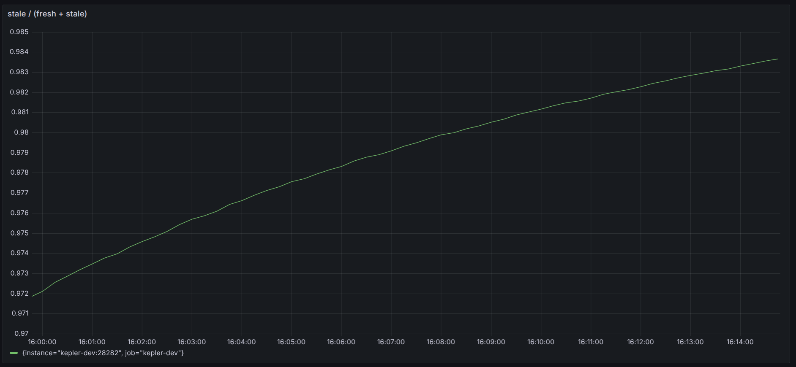
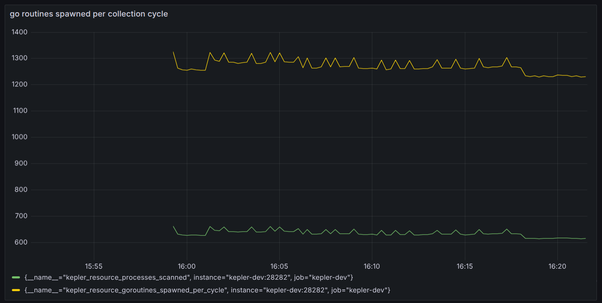

<!-- SPDX-FileCopyrightText: 2025 The Kepler Authors -->
<!-- SPDX-License-Identifier: Apache-2.0 -->

# EP-004: Simplify Kepler's Concurrency Model

**Status**: Draft
**Author**: Vimal Kumar
**Created**: 2026-03-02
**Last Updated**: 2026-03-03

## Summary

Kepler's collection path — read hardware counters, scan processes,
attribute power — is fundamentally a sequential `loop { read; diff; store }`
operation over local filesystems (sysfs, procfs) and library calls (NVML).
The current implementation introduces concurrency at multiple points in
this path, requiring 8 synchronization primitives to coordinate. This
has led to several concurrency bugs, each fixed by either adding more
synchronization or removing the concurrency that caused the bug.

This proposal documents the current concurrency design, the
synchronization it requires, the bugs it has caused, and proposes
a simplified alternative.

## Background

### What the Collection Path Does

Each collection cycle performs these steps:

1. Read CPU energy counters from sysfs
2. Read GPU power/energy via NVML (local library call)
3. Scan `/proc` for processes, read cgroup/environ per process
4. Aggregate processes into containers, VMs, and pods
5. Compute node CPU usage ratio
6. Calculate power attribution (arithmetic, no I/O)
7. Store snapshot

Most steps are local I/O or computation. The one exception is pod
resolution: when a container ID is not found in cache,
`kubeletPodInformer.LookupByContainerID()` triggers an HTTP request
to the kubelet API (`/pods`) within the collection path.

### Design Intent: Scrape-Time Freshness

The concurrency model serves a deliberate purpose: **data freshness at
scrape time** (Architecture Principle #4). Prometheus scrapes at its own
schedule (e.g., every 15-30s), which may not align with Kepler's
collection interval (5s). The `ensureFreshData()` path guarantees that
any scrape receives data at most `maxStaleness` (500ms) old — if the
snapshot is stale, it triggers a fresh collection immediately.

This creates two concurrent entry points into the collection logic:
the periodic timer and the Prometheus scrape handler. The
synchronization machinery exists primarily to coordinate these two
paths safely.

## Current Concurrency Design

### Goroutine Map

```text
main
 └─ oklog/run.Group (1 goroutine per service)
     │
     ├─ PowerMonitor.Run()                          [long-lived]
     │   └─ scheduleNextCollection()                [recursive goroutine]
     │       └─ go func() {                         monitor.go:248
     │              synchronizedPowerRefresh()
     │              scheduleNextCollection()         ← spawns next goroutine
     │          }
     │           └─ singleflight.Do("compute")
     │               └─ resource.Refresh()
     │                   ├─ go refreshContainers+Pods    informer.go:372
     │                   ├─ go refreshVMs                informer.go:378
     │                   ├─ go refreshNode               informer.go:383
     │                   │   └─ wg.Wait()                informer.go:388
     │                   │
     │                   └─ per process:
     │                       └─ computeTypeInfoFromProc()
     │                           ├─ go containerInfoFromProc  informer.go:572
     │                           └─ go vmInfoFromProc         informer.go:578
     │
     ├─ APIServer.Run()                              [long-lived]
     │   └─ go web.ListenAndServe()                  server.go:139
     │       └─ per /metrics scrape:                 [spawned by net/http]
     │           └─ promhttp.Handler
     │               └─ PowerCollector.Collect()
     │                   └─ monitor.Snapshot()
     │                       └─ ensureFreshData()    ← can trigger collection
     │                           └─ synchronizedPowerRefresh()
     │                               └─ singleflight.Do("compute")
     │
     ├─ KubeletPodInformer.Run()                     [long-lived, ticker loop]
     ├─ StdoutExporter.Run()                         [long-lived, ticker loop]
     ├─ RedfishService.Run()                         [long-lived, blocks on ctx]
     └─ SignalHandler.Run()                          [long-lived, blocks on signal]
```

### Synchronization Primitives

The concurrency design requires the following primitives:

| Primitive                        | Location              | Purpose                                          |
|----------------------------------|-----------------------|--------------------------------------------------|
| `singleflight.Group`             | `monitor.go:61`       | Prevent concurrent refresh from timer + scrape   |
| `atomic.Pointer[Snapshot]`       | `monitor.go:62`       | Lock-free snapshot reads across goroutines       |
| `atomic.Bool`                    | `monitor.go:71`       | Track export state across goroutines             |
| `sync.WaitGroup`                 | `monitor.go:84`       | Track recursive goroutine lifecycle for shutdown |
| `context.Context` + `CancelFunc` | `monitor.go:82-83`    | Cancel recursive goroutines on shutdown          |
| `chan struct{}` (buffered 1)     | `monitor.go:59`       | Signal exporters when new data is ready          |
| `sync.WaitGroup`                 | `informer.go:368`     | Join 3 parallel refresh goroutines               |
| `chan result` (buffered 1) ×2    | `informer.go:569-570` | Per-process container/VM detection               |

## Findings

### Scrape-Dominated Collection

With the default configuration (`interval=5s`, `maxStaleness=500ms`),
data is almost always older than 500ms when a Prometheus scrape
arrives. This means `ensureFreshData()` triggers a fresh collection
on nearly every scrape — the periodic timer rarely provides data
that is fresh enough.

Profiling confirms this: **~98% of scrapes find data stale** and
trigger a full collection.



*`kepler_monitor_scrapes_stale_total / (kepler_monitor_scrapes_stale_total + kepler_monitor_scrapes_fresh_total)`.
Prometheus scraping every 5s, collection interval 5s, staleness 500ms.*

This means the periodic timer's collection is almost always wasted —
by the time the next scrape arrives, the timer's data is already
stale. The node performs the same collection **twice per interval**:
once from the timer (unused) and once from the scrape (served).

The entire concurrency machinery — singleflight, recursive
goroutines, atomic snapshot, WaitGroup — exists to safely handle
two paths racing to do the same collection, when in practice one
path (scrape-triggered) dominates. The timer's primary role is
ensuring data exists when no one is scraping (e.g., for the stdout
exporter or at startup).

### Scrape Latency Is Coupled to Collection Duration

When a scrape arrives and data is stale, `ensureFreshData()` runs the
full collection synchronously in the scrape handler's goroutine:

```text
scrape handler (net/http goroutine)
  → PowerCollector.Collect()
    → monitor.Snapshot()
      → ensureFreshData()
        → synchronizedPowerRefresh()
          → singleflight.Do("compute", ...)
            → refreshSnapshot()          ← blocks here for full collection
```

The scrape handler blocks for the entire collection duration.
Singleflight does not reduce this latency — it only prevents a
second concurrent collection if the timer happens to fire at the
same moment. On a production node with thousands of processes,
collection can take hundreds of milliseconds, and the scrape
absorbs that cost directly. **This is inherent to any design that
guarantees data freshness at scrape time** — simplifying the
concurrency model does not change this property.

### Fan-Out in `Refresh()` Parallelizes In-Memory Work, Not I/O

The 3-way fan-out runs `refreshContainers+Pods`, `refreshVMs`, and
`refreshNode` in parallel. However:

```text
refreshProcesses()              ← scans /proc (runs SEQUENTIALLY first)
    │
    ├── containerProcs           ← output: in-memory list
    ├── vmProcs                  ← output: in-memory list
    │
    ▼ (current: parallel fan-out)
refreshContainers(containerProcs)  ← in-memory map aggregation, NO I/O
refreshVMs(vmProcs)                ← in-memory map aggregation, NO I/O
refreshNode()                      ← single /proc/stat read
```

`refreshContainers` and `refreshVMs` operate on already-collected
process data — in-memory map iterations with no procfs reads. The only
I/O is `refreshNode()` reading one file. There is no I/O to overlap.

### Per-Process Goroutine Churn

`computeTypeInfoFromProc()` spawns 2 goroutines per process to read
`/proc/<pid>/cgroup` and `/proc/<pid>/environ` in parallel. On a
development host with ~640 processes, this creates ~1280 goroutines
per cycle (every 5s). Each goroutine is spawned and joined inline,
so only 2 are concurrent at any instant — but each incurs goroutine
allocation, channel creation, and scheduling overhead for what are
microsecond-level virtual filesystem reads.



*`kepler_resource_goroutines_spawned_per_cycle` (yellow) and
`kepler_resource_processes_scanned` (green). The 2:1 ratio reflects
2 goroutines spawned per process in `computeTypeInfoFromProc()`.*

### Data Freshness Does Not Require Concurrent Collection

A sequential design would run `refreshNode()` after container/VM
aggregation instead of in parallel. Since containers and VMs are
derived from already-collected process data (in-memory map iterations
taking microseconds), the additional delay is negligible compared to
the freshness window that `refreshProcesses()` itself introduces
(scanning all PIDs takes milliseconds).

The collection interval is 5 seconds. Whether collection takes 20ms
or 40ms has no impact on the `maxStaleness` guarantee (500ms). The
scrape-time freshness guarantee does not require concurrent collection
— it requires that a scrape can trigger collection when data is stale.

### Profiled Goroutine Counts

Captured in a containerized deployment (docker compose, Prometheus
scraping every 5s, ~640 processes on the host).

**Concurrent goroutines** (`go_goroutines` from Prometheus, 5-minute window):

```text
min: 14   max: 21   avg: 16.5

Distribution (61 samples):
  goroutines=14: 17   (baseline — no collection)
  goroutines=15:  4
  goroutines=16:  5
  goroutines=17: 11
  goroutines=18: 12
  goroutines=19:  8
  goroutines=20:  2
  goroutines=21:  2   (peak — collection + scrape overlap)
```

**Goroutines created per cycle** (instrumented via `runtime.NumGoroutine()`):

```text
before_refreshProcesses=10  during_fanout=13  after_fanout=10  processes=640
```

The fan-out in `Refresh()` adds exactly 3 concurrent goroutines.
The per-process fan-out creates ~1280 goroutines per cycle but only
2 are concurrent at any instant.

## Concurrency-Related Bug History

The following commits on `main` fix concurrency issues in the
collection path. The "Caused by" column maps each bug to the specific
concurrency design choice that created the problem.

| Commit     | PR    | Fix                                                            | Caused by                                                                                      |
|------------|-------|----------------------------------------------------------------|------------------------------------------------------------------------------------------------|
| `b43260a9` | —     | Removed goroutines that mutated maps concurrently              | Fan-out goroutines writing to shared maps without synchronization                              |
| `99a271ec` | #2146 | Added context check after `select` in `scheduleNextCollection` | Recursive goroutine scheduling — `select` on timer + context can pick timer after cancellation |
| `c5a2be5e` | —     | Replaced `RWMutex` with `atomic.Pointer` for snapshot access   | Lock contention between collection goroutine and scrape handler reading snapshots              |
| `7c0ee313` | #2386 | Added synchronization to test cleanup                          | Recursive collection goroutine outlived test — no lifecycle tracking                           |
| `a64511b4` | —     | Moved mock cleanup to safe point                               | Background collection goroutine read mock expectations during `t.Cleanup`                      |
| `c164049e` | #2394 | Added `WaitGroup` to track goroutine lifecycle                 | Recursive `scheduleNextCollection` — `Run()` returned while goroutines still executing         |

Each fix either (a) added more synchronization to handle goroutine
interactions, or (b) removed goroutines to eliminate the race.
Note that `14aadff0` (PR #2146) is the merge commit containing `99a271ec`.

### Scenario 1: Timer vs Context Cancellation Race

**Commit**: `99a271ec` (PR #2146)

`scheduleNextCollection` uses `select` on both the timer channel and
context cancellation. When both are ready simultaneously, Go's `select`
randomly picks one. If it picks the timer, a collection runs after
cancellation.

The fix added an explicit context check after the select. With a
ticker loop, this race is structurally impossible — `for-select` on
`ticker.C` and `ctx.Done()` handles this naturally.

### Scenario 2: Goroutine Lifecycle Race

**Commit**: `c164049e` (PR #2394)

Because `scheduleNextCollection` spawns goroutines recursively, there
was no mechanism to wait for in-flight goroutines during shutdown.
`Run()` would return while background goroutines were still executing,
causing mock access after test cleanup.

The fix added `sync.WaitGroup` tracking. Related test fixes:
`a64511b4`, `7c0ee313`.

With a ticker loop, lifecycle tracking is unnecessary — when the
loop exits, all collection work is done.

### Scenario 3: Concurrent Map Mutation

**Commit**: `b43260a9`

Goroutines were updating shared maps concurrently without
synchronization. The fix removed the goroutines and made updates
sequential.

The same pattern exists in `resource.Refresh()` (`informer.go:372-386`),
where three goroutines write to structurally related state. The
current code operates on disjoint fields, but this is a fragile
invariant.

## Goals

- Document the concurrency design and the synchronization it requires
- Present the bug history as evidence of complexity cost
- Establish whether the concurrency is justified for local I/O workloads
- Inform a follow-up proposal if simplification is warranted

## Non-Goals

- Propose a specific refactoring (deferred to follow-up EP)
- Change the service lifecycle model (`oklog/run.Group` is appropriate)
- Remove concurrency from HTTP server or pod informers (legitimate needs)
- Optimize collection performance

## Proposed Alternative

### Collection Model

Replace the recursive goroutine scheduler with a simple ticker loop
and make all collection sequential:

```go
func (pm *PowerMonitor) Run(ctx context.Context) error {
    // Initial collection
    pm.collect()

    ticker := time.NewTicker(pm.interval)
    defer ticker.Stop()

    for {
        select {
        case <-ctx.Done():
            return nil
        case <-ticker.C:
            pm.collect()
        }
    }
}
```

Within `collect()`, all steps run sequentially:

```text
collect()
  → resource.Refresh()
      → refreshProcesses()        sequential
      → refreshContainers()       sequential
      → refreshVMs()              sequential
      → refreshPods()             sequential
      → refreshNode()             sequential
  → readEnergy()
  → calculatePower()
  → storeSnapshot()
```

Per-process type detection (`computeTypeInfoFromProc`) also becomes
sequential — call `containerInfoFromProc` and `vmInfoFromProc`
directly instead of spawning 2 goroutines per process.

### Scrape-Time Freshness

The scrape handler calls `collect()` directly when data is stale,
guarded by a `sync.Mutex` to prevent overlap with the ticker:

```go
func (pm *PowerMonitor) Snapshot() (*Snapshot, error) {
    if !pm.isFresh() {
        pm.mu.Lock()
        if !pm.isFresh() {  // double-check after acquiring lock
            pm.collect()
        }
        pm.mu.Unlock()
    }
    return pm.snapshot.Load(), nil
}
```

The ticker also acquires the same mutex before collecting. This is
the same double-check pattern currently implemented via singleflight,
but with a standard `sync.Mutex`.

### Network I/O During Collection (DCGM)

The DCGM exporter integration fetches GPU utilization via HTTP during
collection. This is the one step that benefits from concurrency — it
can overlap with the procfs scan:

```go
func (pm *PowerMonitor) collect() {
    var dcgmData *DCGMData
    var wg sync.WaitGroup

    if pm.dcgmEnabled {
        wg.Add(1)
        go func() {
            defer wg.Done()
            dcgmData = pm.fetchDCGM()
        }()
    }

    pm.resources.Refresh()  // sequential procfs scan
    wg.Wait()               // wait for DCGM if running

    pm.calculatePower(dcgmData)
    pm.storeSnapshot()
}
```

This is a targeted `go fetch(); scan(); wait()` — one goroutine for
a real network call, not a broad concurrency model. The WaitGroup
here is scoped to a single function call, not a lifecycle primitive.

### Primitives Eliminated

| Current                         | Proposed     | Reason                                   |
|---------------------------------|--------------|------------------------------------------|
| `singleflight.Group`            | `sync.Mutex` | Simpler; same double-check semantics     |
| `sync.WaitGroup` (monitor)      | removed      | Ticker loop has deterministic lifecycle  |
| `context + cancel` (collection) | removed      | Ticker loop uses parent context directly |
| `sync.WaitGroup` (informer)     | removed      | No fan-out                               |
| `chan result` ×2 per process    | removed      | Sequential type detection                |

Retained:

- `atomic.Pointer[Snapshot]` — appropriate for single-writer, multiple-reader
- `chan struct{}` — signal non-scrape exporters (stdout)
- `atomic.Bool` — export state tracking

**Net result: 8 primitives → 4**, and the 4 that remain are
straightforward (mutex, atomic pointer, channel, atomic bool).

## Open Questions

1. **Network I/O in the collection path**: The DCGM exporter
   integration fetches GPU utilization metrics via HTTP during
   collection. This is a legitimate case for concurrency — the
   network fetch could run in parallel with the procfs scan. However,
   this is a targeted `go fetch(); scan(); wait()` pattern, not a
   justification for the broad concurrency model (recursive
   goroutines, per-process fan-out, singleflight) documented above.

2. **Should the timer be removed entirely?** Findings show ~98% of
   scrapes trigger their own collection, making the timer's work
   redundant. The timer's only role is providing data for non-scrape
   consumers (stdout exporter, startup). Could these be served
   differently?

## References

- Architecture principles: `docs/developer/design/architecture/principles.md`
- Service framework: `internal/service/service.go`
- Monitor implementation: `internal/monitor/monitor.go`
- Resource informer: `internal/resource/informer.go`
