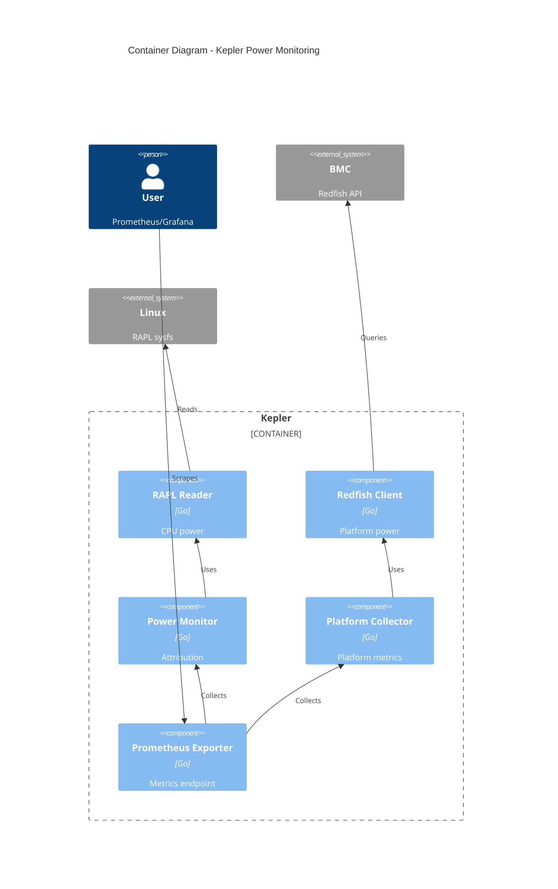
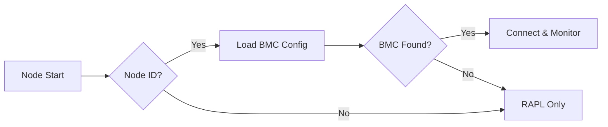
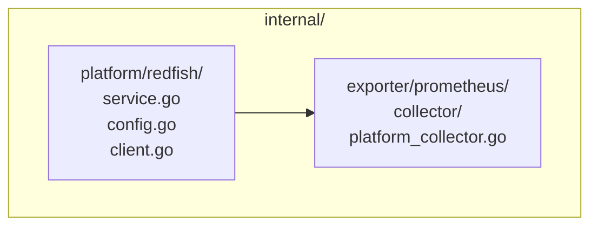

# EP-001: Redfish Power Monitoring Support

- **Status**: Draft
- **Author**: Sunil Thaha
- **Created**: 2025-08-14

## Summary

Add Redfish BMC power monitoring to Kepler for platform-level power consumption data,
complementing existing RAPL CPU monitoring to provide comprehensive server power
visibility.

## Problem

Kepler currently measures only CPU power via Intel RAPL, missing:

- Platform power (PSU, cooling, storage, network)
- Multi-vendor support (AMD, ARM systems)
- BMC integration capabilities already present in data centers

## Goals

- Add Redfish BMC power monitoring capability
- Support Kubernetes, bare metal, and standalone deployments
- Integrate with existing Kepler architecture
- Maintain security best practices

## Non-Goals

- Replace RAPL monitoring (complementary)
- Support non-Redfish protocols (IPMI) initially
- Implement power control features
- Advanced resilience patterns in v1

## Solution

Add platform service layer collecting BMC power data via Redfish, exposed through
Prometheus collectors separately from CPU power attribution.



## Node Identification

Nodes identified via `--platform.redfish.node-id` flag or `platform.redfish.nodeID` config,
matching identifiers in BMC configuration file. E.g.

```bash
kepler --platform.redfish.node-id=worker-1
```

1. **Configuration**: `platform.redfish.nodeID` as below

```yaml
# config.yaml

  platform:
    redfish:
      nodeID: worker-1
```



## Implementation

### Package Structure



### Service Interfaces

Implements standard Kepler patterns:

- `service.Initializer`: Configuration and connection setup
- `service.Runner`: Periodic power collection with context
- `service.Shutdowner`: Clean resource release

### Configuration

**Kepler Config Structure:**

```go
type Platform struct {
    Redfish Redfish `yaml:"redfish"`
}

type Redfish struct {
    Enabled    *bool  `yaml:"enabled"`
    NodeID     string `yaml:"nodeID"`
    ConfigFile string `yaml:"configFile"`
}
```

**CLI Flags:**

```bash
--platform.redfish.enabled=true
--platform.redfish.node-id=worker-1
--platform.redfish.config=/etc/kepler/redfish.yaml
```

**Main Configuration (`hack/config.yaml`):**

```yaml
# ... existing config sections ...

platform:
  redfish:
    enabled: true
    nodeID: "worker-1"  # Node identifier for BMC mapping
    configFile: "/etc/kepler/redfish.yaml"
```

**BMC Configuration (`/etc/kepler/redfish.yaml`):**

The configuration separates node-to-BMC mappings from BMC credentials for several reasons:

- **Multi-tenant deployments**: Multiple VMs/nodes can share the same BMC (blade servers, virtualized environments)
- **Credential reuse**: Same BMC credentials can be shared across multiple node mappings
- **Operational flexibility**: Easy to reassign nodes to different BMCs without credential changes

```yaml
nodes:
  baremetal-worker-1: bmc-1
  baremetal-worker-2: bmc-2
  vm_worker-3: BMC_2_VM
  vm_worker-4: BMC_2_VM

bmcs:
  bmc-1:
    endpoint: "https://192.168.1.100"
    username: "admin"
    password: "secret"
    insecure: true  # TLS verification

  bmc-2:
    endpoint: "https://192.168.1.101"
    username: "admin"
    password: "secret456"
    insecure: false               # Verify TLS certificates

  BMC_2_VM:
    endpoint: "https://192.168.1.103"
    username: "admin"
    password: "secret456"
    insecure: false

```

## Metrics

Platform-level metrics are introduced as a separate metric namespace to distinguish from
node-level power attribution. While Kepler's existing metrics attribute power consumption
to workloads running on a node, platform metrics represent the total power consumed by
the underlying bare metal server (via BMC), regardless of whether Kepler runs on bare
metal or within a VM. This separation enables:

- Multiple VMs on the same bare metal to report the same platform power
- Clear distinction between attributed workload power and total platform power
- Aggregation by BMC ID to get actual bare metal consumption: `max by(bmc) (kepler_platform_watts)`

**Important**: This implementation uses a **power-only (Watts) approach**.
Energy counters (`kepler_platform_joules_total`) are not supported because:

- Redfish does not provide native energy counters
- BMC polling is intermittent (every 10 seconds) vs continuous monitoring

```prometheus
# Platform power metrics (bare metal power consumption)
kepler_platform_watts{source="redfish",node_name="worker-1",bmc="bmc-1",chassis_id="System.Embedded.1"} 450.5

# Existing node metrics unchanged (workload attribution)
kepler_node_cpu_watts{zone="package",node_name="worker-1"} 125.2
```

## Error Handling

- Connection failures: Log errors and continue to run (instead of terminating)
- Authentication errors: Retry once, then disable for node
- Timeouts: 30-second context timeout for BMC requests
- Graceful degradation when BMCs unavailable

## Security

- Credentials in Kubernetes secrets or secure files (mode 0600)
- No credential logging
- Require explicit opt-in via configuration

## Implementation Phases

1. **Foundation**: Dependencies, service structure, config parsing
2. **Core**: Gofish integration, power collection, service interface
3. **Metrics**: Platform collector, Prometheus registration
4. **Testing**: Unit, integration, multi-vendor validation
5. **Release**: Documentation, migration guides

## Testing Strategy

- Unit tests with mocked Redfish responses
- Integration tests with Redfish simulator
- Performance impact validation (<2% overhead target compared to base kepler)

## Migration

- **Backward Compatible**: No breaking changes, opt-in feature
- **Phased Rollout**: Test subset before full deployment
- **Rollback**: Disable via config flag, continues with RAPL-only

## Risks and Mitigations

| Risk                 | Mitigation                              |
|----------------------|-----------------------------------------|
| BMC connectivity     | Retry logic, graceful degradation       |
| Vendor compatibility | Multi-vendor testing                    |
| Performance impact   | <2% overhead validation                 |
| Security             | Secure credential handling, TLS default |

## Future Enhancements

- Circuit breaker patterns
- Exponential backoff strategies
- External secret integration
- Chassis sub-component power zones

## Open Questions

1. Multi-chassis server handling?
2. Sub-component power exposure (PSU, fans)?
