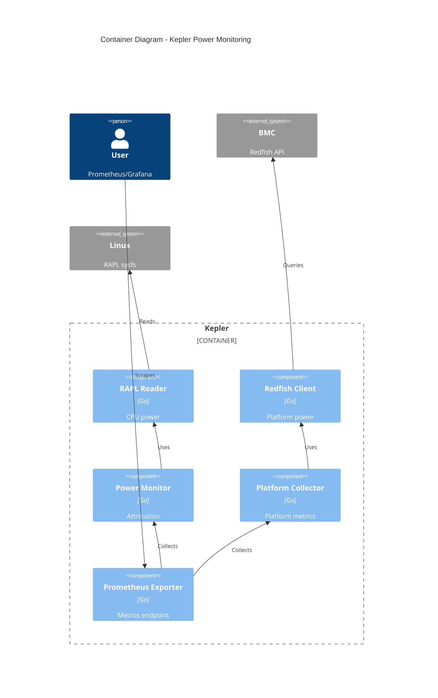
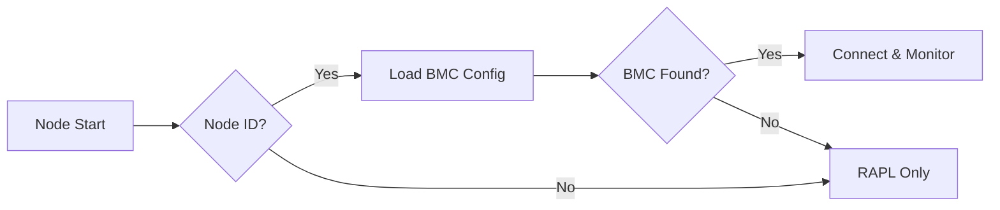
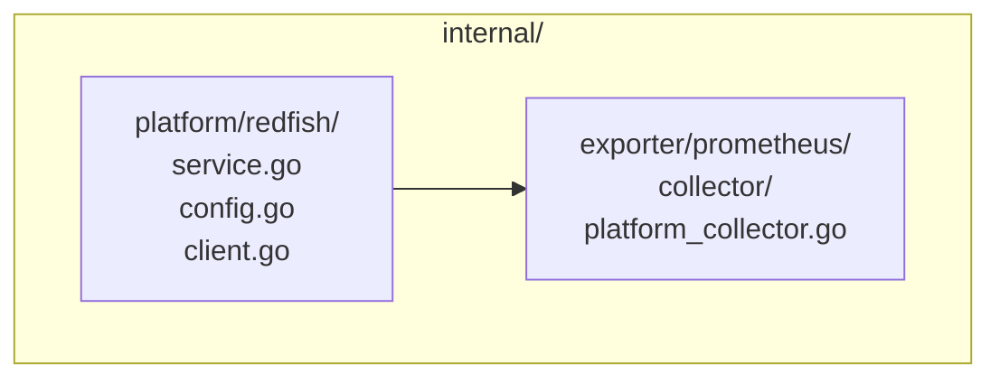

# EP-001: Redfish Power Monitoring Support

- **Status**: Implemented
- **Maturity**: Experimental
- **Author**: Sunil Thaha
- **Created**: 2025-08-14
- **Updated**: 2025-09-03

## Summary

Redfish BMC power monitoring has been added to Kepler as an experimental feature, providing
platform-level power consumption data that complements existing RAPL CPU monitoring
for complete server power visibility.

## Problem

Kepler currently measures only CPU power via Intel RAPL, missing:

- Platform power (PSU, cooling, storage, network)
- Multi-vendor support (AMD, ARM systems)
- BMC integration capabilities already present in data centers

## Goals

- Add Redfish BMC power monitoring capability
- Support Kubernetes, bare metal, and standalone deployments
- Integrate with existing Kepler architecture
- Maintain security best practices

## Non-Goals

- Replace RAPL monitoring (complementary)
- Support non-Redfish protocols (IPMI) initially
- Implement power control features
- Advanced resilience patterns in v1

## Solution

Add platform service layer collecting BMC power data via Redfish, exposed through
Prometheus collectors separately from CPU power attribution.



## Node Identification

Nodes are automatically identified using the following priority:

1. **CLI flag**: `--experimental.platform.redfish.node-name=worker-1`
2. **Configuration**: `experimental.platform.redfish.nodeName` in config.yaml
3. **Kubernetes node name**: Automatically detected when Kubernetes is enabled
4. **Hostname fallback**: System hostname used if no explicit identifier provided

```bash
# Explicit node name
kepler --experimental.platform.redfish.node-name=worker-1

# Or automatic resolution from Kubernetes node name
kepler --kube.enabled --kube.node-name=worker-1
```

**Configuration Example:**

```yaml
# config.yaml
experimental:
  platform:
    redfish:
      nodeName: worker-1  # Optional - will auto-resolve to kube.node or hostname if not provided
```



## Implementation

### Package Structure



### Service Interfaces

Implements standard Kepler patterns:

- `service.Initializer`: Configuration and BMC connection setup
- `service.Shutdowner`: Clean resource release and client disconnection

### Implementation Details

**Hybrid PowerSubsystem with Power API Fallback Architecture:**

- `Power()`: synchronous method returning power readings from all chassis with automatic API selection
- **Primary**: Modern Redfish PowerSubsystem API (PowerSupplies collection)
- **Fallback**: Deprecated Power API (PowerControl array) for backward compatibility
- Automatic fallback when PowerSubsystem is unavailable or returns errors
- Simple staleness-based caching to reduce BMC API calls
- Individual power source exposure with generic labeling (chassis_id, source_id, source_name, source_type)
- BMC API calls only when cached data is stale or unavailable
- Source type differentiation enables clear identification of API used

**Service Lifecycle:**

- `Init()`: Establishes BMC connection, validates credentials
- `Shutdown()`:  Disconnects from BMC

### Configuration

**Kepler Config Structure:**

```go
type Platform struct {
    Redfish Redfish `yaml:"redfish"`
}

type Redfish struct {
    Enabled     *bool         `yaml:"enabled"`
    NodeName    string        `yaml:"nodeName"`
    ConfigFile  string        `yaml:"configFile"`
    HTTPTimeout time.Duration `yaml:"httpTimeout"` // HTTP client timeout for BMC requests
}
```

**CLI Flags:**

```bash
--experimental.platform.redfish.enabled=true
--experimental.platform.redfish.node-name=worker-1
--experimental.platform.redfish.config=/etc/kepler/redfish.yaml
# Note: httpTimeout is configuration-only (not exposed as CLI flag)
```

**Main Configuration (`hack/config.yaml`):**

```yaml
# ... existing config sections ...

experimental:
  platform:
    redfish:
      enabled: true
      nodeName: "worker-1"  # Node identifier for BMC mapping
      configFile: "/etc/kepler/redfish.yaml"
      httpTimeout: 5s     # HTTP client timeout for BMC requests
```

**BMC Configuration (`/etc/kepler/redfish.yaml`):**

The configuration separates node-to-BMC mappings from BMC credentials for several reasons:

- **Multi-tenant deployments**: Multiple VMs/nodes can share the same BMC (blade servers, virtualized environments)
- **Credential reuse**: Same BMC credentials can be shared across multiple node mappings
- **Operational flexibility**: Easy to reassign nodes to different BMCs without credential changes

```yaml
nodes:
  baremetal-worker-1: bmc-1
  baremetal-worker-2: bmc-2
  vm_worker-3: BMC_2_VM
  vm_worker-4: BMC_2_VM

bmcs:
  bmc-1:
    endpoint: "https://192.168.1.100"
    username: "admin"
    password: "secret"
    insecure: true  # TLS verification

  bmc-2:
    endpoint: "https://192.168.1.101"
    username: "admin"
    password: "secret456"
    insecure: false               # Verify TLS certificates

  BMC_2_VM:
    endpoint: "https://192.168.1.103"
    username: "admin"
    password: "secret456"
    insecure: false

```

## Collection Strategy

The Redfish service implements a **on-demand collection with caching**:

### On Demand Collection Mode with Caching

- No background collection or periodic polling
- Direct BMC API calls during Prometheus scrape via `Power()`
- Implements simple caching with staleness-based expiration to
 support multiple Prometheus scrapes in a short period (High Availability)
- Returns cached data if available and fresh, otherwise collects fresh data
- Returns all chassis with detailed power supply readings in a single call via PowerSubsystem
- Each power supply entry identified by `chassis_id`, `source_id`, and `source_name` for granular metric labeling

### Multiple Chassis and PowerSupply Support

- `Power()` method returns `*PowerReading` (single reading containing multiple chassis with detailed power supply data via PowerSubsystem)
- `PowerReading` struct contains `[]Chassis` slice, each with `ID` and `[]Reading` for individual power supply entries
- Iterates through all available chassis on the BMC and their PowerSubsystem → PowerSupplies arrays
- Filters and returns only power supply entries with valid power output readings
- Each reading includes `SourceID`, `SourceName`, and `Power` for granular power supply monitoring
- Exposes individual power supply entries as separate metrics (e.g., Power Supply 1, Power Supply 2, Power Supply Bay 1)

## Metrics

Platform-level metrics are introduced as a separate metric namespace to distinguish from
node-level power attribution. While Kepler's existing metrics attribute power consumption
to workloads running on a node, platform metrics represent individual power domains from
the underlying bare metal server (via BMC), regardless of whether Kepler runs on bare
metal or within a VM.

**PowerSupply Granularity**: Each power supply from the BMC's PowerSubsystem → PowerSupplies collection is
exposed as an individual metric with detailed labels. This approach provides direct visibility into
individual power supply output and allows users to understand their hardware's power supply topology
and redundancy configuration.

This separation enables:

- Multiple VMs on the same bare metal to report the same platform power
- Clear distinction between attributed workload power and platform power supplies
- Granular monitoring of individual power supplies and their redundancy status
- Direct visibility into power supply efficiency and utilization

**Important**: This implementation uses a **power-only (Watts) approach**.
Energy counters (`kepler_platform_joules_total`) are not supported because:

- Redfish does not provide native energy counters
- Collection frequency varies based on demand and configuration

```prometheus
# Platform power metrics (bare metal power consumption) - hybrid API approach with source_type differentiation

# Modern PowerSubsystem API (PowerSupplies)
kepler_platform_watts{source="redfish",node_name="worker-1",bmc_id="bmc-1",chassis_id="System.Embedded.1",source_id="PS1",source_name="Power Supply 1",source_type="PowerSupply"} 245.0
kepler_platform_watts{source="redfish",node_name="worker-1",bmc_id="bmc-1",chassis_id="System.Embedded.1",source_id="PS2",source_name="Power Supply 2",source_type="PowerSupply"} 0.0

# Fallback Power API (PowerControl) when PowerSubsystem unavailable
kepler_platform_watts{source="redfish",node_name="worker-1",bmc_id="bmc-1",chassis_id="System.Embedded.1",source_id="0",source_name="System Power Control",source_type="PowerControl"} 189.5

# Existing node metrics unchanged (workload attribution)
kepler_node_cpu_watts{zone="package",node_name="worker-1"} 125.2
```

## Error Handling

- Connection failures: Log errors and continue to run (instead of terminating)
- Authentication errors: Retry once, then disable for node
- Timeouts: Configurable HTTP client timeout for BMC requests (default 5 seconds)
- Individual chassis failures: Skip failed chassis and continue with available ones
- Graceful degradation when BMCs unavailable

## Security

- Credentials in Kubernetes secrets or secure files (mode 0600)
- No credential logging
- Require explicit opt-in via configuration

## Implementation Status

**✅ Implemented and Available (Experimental):**

1. **Core**: Full Gofish integration with hybrid PowerSubsystem/Power API collection and service interfaces
2. **API Hybrid Approach**: PowerSubsystem API (modern) with automatic fallback to Power API (deprecated) for backward compatibility
3. **Metrics**: Platform collector with generic source_id/source_name/source_type labels for power data
4. **Configuration**: CLI flags and YAML configuration with automatic node ID resolution
5. **Testing**: Unit tests with mock server including PowerSubsystem, Power API, and fallback scenarios
6. **Caching**: Staleness-based caching to reduce BMC API calls
7. **Multiple Chassis and Sources**: Support for collecting detailed power data from all chassis via both APIs with source differentiation
8. **Fallback Logic**: Automatic detection and fallback when PowerSubsystem is unavailable

**Current State:**

- Feature is **experimental** and requires explicit opt-in via configuration
- All described functionality is implemented and tested
- Available for use in controlled environments
- Simplified architecture reduces complexity while providing core functionality

## Implementation Phases

1. **Core**: Gofish integration, power collection, service interface ✅
2. **Metrics**: Platform collector, Prometheus registration ✅
3. **Testing**: Unit, integration, multi-vendor validation ✅
4. **Release**: Documentation, migration guides ✅

## Testing Strategy

**Implemented Testing:**

- **Unit tests**: Full test coverage with mocked PowerSubsystem and Power API responses
- **Mock server**: HTTP server simulating BMC Redfish PowerSubsystem and Power API endpoints for different vendors
- **PowerSupply fixtures**: Dell, HPE, Lenovo PowerSupply collection response variations
- **PowerControl fixtures**: PowerControl array response variations for fallback testing
- **Fallback scenarios**: Comprehensive testing of PowerSubsystem → Power API fallback logic
- **Error conditions**: Connection failures, authentication errors, timeouts, missing chassis/power supplies/power subsystems
- **Source type validation**: Testing proper source_type assignment for PowerSupply vs PowerControl
- **Concurrency testing**: Race detection and thread safety validation
- **Caching behavior**: Staleness-based caching and cache expiry testing
- **Service lifecycle**: Complete Init, Power (hybrid approach), and Shutdown testing

**Testing Infrastructure:**

- Mock Redfish server with configurable response scenarios and error injection
- Test data validation helpers and assertion functions
- Race condition testing with `go test -race`
- Service lifecycle testing covering all service interfaces
- Configuration validation and error handling tests
- BMC configuration file loading and node mapping tests

**Performance Validation:**

- On-demand collection with caching reduces BMC load
- Simplified architecture minimizes overhead
- Multiple chassis data collected in single BMC interaction
- Built-in staleness management to optimize performance

## Migration

- **Backward Compatible**: No breaking changes, opt-in feature
- **Phased Rollout**: Test subset before full deployment
- **Rollback**: Disable via config flag, continues with RAPL-only

## Risks and Mitigations

| Risk                 | Mitigation                              |
|----------------------|-----------------------------------------|
| BMC connectivity     | Retry logic, graceful degradation       |
| Vendor compatibility | Multi-vendor testing                    |
| Performance impact   | <2% overhead validation                 |
| Security             | Secure credential handling, TLS default |

## Experimental Maturity

**Why Experimental:**

- First implementation of BMC integration in Kepler
- Multi-vendor compatibility needs broader testing
- Performance impact requires real-world validation
- Configuration patterns may evolve based on user feedback

**Path to Stable:**

1. **Field Testing**: Deploy in controlled environments
2. **Vendor Validation**: Test with additional BMC implementations
3. **Performance Analysis**: Measure production impact and optimization
4. **Community Feedback**: Iterate based on user experience
5. **API Stabilization**: Finalize configuration and metric structures

**Current Limitations:**

- Power-only metrics (no energy counters due to intermittent BMC polling)
- Basic staleness-based caching (more advanced cache management could be added)
- BMC calls during Prometheus scrape when cache is stale (mitigated by built-in caching)
- Optimal for modern Redfish implementations with PowerSubsystem support (gracefully falls back to deprecated Power API)
- Tested with mock servers simulating both PowerSubsystem and Power API scenarios

## Future Enhancements

- Background collection with better caching for improved performance
- Enhanced cache management and retry logic
- Circuit breaker patterns for BMC failure handling
- External secret integration (Kubernetes, Vault)
- Chassis sub-component power zones (PSU, fans, storage)
- Energy counter derivation for long-term monitoring
- Additional BMC authentication methods

## Open Questions

1. ~~Multi-chassis server handling for complex hardware?~~ **Addressed**: `ChassisPower()` returns all chassis with power readings
2. ~~Need for caching layer in future versions?~~ **Addressed**: Simple caching layer implemented
3. Sub-component power exposure (PSU, fans) priority?
4. Integration with other platform monitoring tools?
5. Performance impact of BMC calls during Prometheus scrape (mitigated by caching)?
6. Better cache management strategies for high-frequency monitoring?
