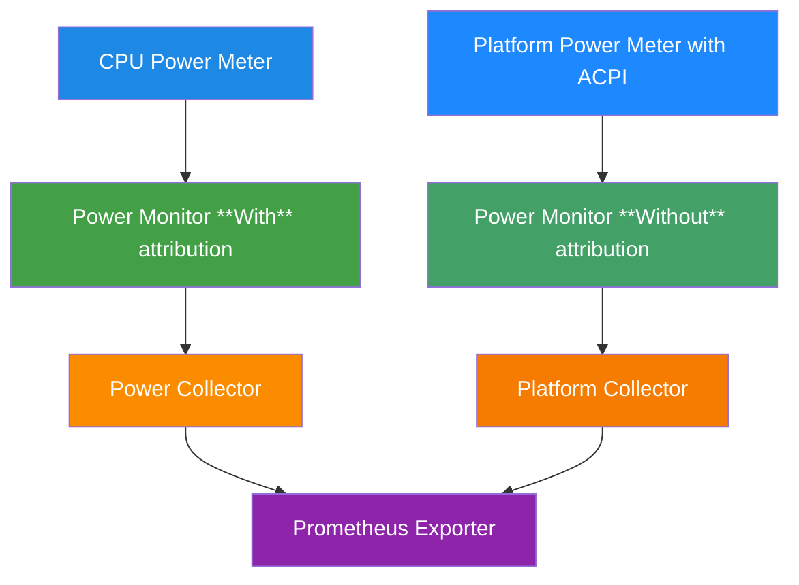

# EP-004: ACPI Support for Platform Power/Energy Metrics

**Status**: Draft
**Author**: Ray Huang
**Created**: 2025-08-28
**Last Updated**: 2025-08-29

## Summary

The proposal aims to add ACPI support for collecting power metrics in Kepler, specifically for nodes that do not have Redfish capabilities.
This enhancement will allow users to gather platform power metrics from a wider range of hardware, improving the flexibility of Kepler in diverse hardware environments.

## Problem Statement

Not all nodes have Redfish for getting platform power metrics, so this proposal aims to add another option to Kepler that allows users to collect power metrics with ACPI that do not support Redfish.

### Current Limitations

1. Nodes without Redfish support cannot get platform power metrics with Kepler.
2. RAPL may not be available on all hardware, limiting the ability to monitor power metrics.
3. Redfish support is unable to provide platform energy metrics.

## Goals

- **Primary**: Add ACPI power meter monitoring option to Kepler.
- **Seamless Integration**: Integrate with existing Kepler architecture and service patterns
- **Standard Metrics**: Provide platform power metrics via Prometheus following Kepler conventions
- **Multi-Environment Support**: Support Kubernetes and standalone deployments

## Non-Goals

- Replace Redfish support. (Just complementary)
- Support all ACPI features such as setting power limits. (focus on reading power_meter)
- Integration with virtualized environments (e.g., VMs without ACPI pass-through).
- Backward compatibility with legacy ACPI versions (<4.0) or non-Linux systems.

## Requirements

### Functional Requirements

- Use [golang sysfs package](https://github.com/prometheus/procfs) which is used by RAPL to read ACPI power_meter so that no additional dependencies.
- Generate `kepler_platform_watts{source="acpi"}` and
  `kepler_platform_joules_total{source="acpi"}` metrics
- Follow Kepler's configuration patterns and coding conventions

### Non-Functional Requirements

- **Performance**: Try to minimize overhead during metric collection.
- **Reliability**: Handle module loading failures and sysfs read errors without crashing Kepler.
- **Security**: Same as RAPL part. Only read access for host's sysfs.
- **Maintainability**: Modular code structure.
- **Testability**: Mock sysfs for unit/integration tests.

## Proposed Solution

### High-Level Architecture

Add ACPI option which is an alternative of Redfish to Kepler.
ACPI can collect platform power metrics from reading sysfs. The platform collector is able to reuse the one that Redfish uses if merged.



### Aggregate power metrics

According to [the ACPI spec for power meter](https://docs.kernel.org/hwmon/acpi_power_meter.html#special-features), there may be more than one power meter available per platform (`/sys/bus/acpi/drivers/power_meter/ACPI000D:XX/power[1-*]_average`).
To acquire power metrics for whole platform, I will aggregate metrics from all available power meters.

## Detailed Design

### Package Structure

```text
cmd/
├── kepler/
│   └── main.go  # Add ACPI power monitor when enabled
config/
│   └── config.go  # Add config for ACPI
internal/
├── device/
│   └── platform/
│       └── acpi/
|           ├── testdata/
|           |   └── sys/bus/acpi/drivers/power_meter/...
│           ├── service.go  # Power monitor for ACPI implementation
│           ├── acpi_power_meter_test.go
│           └── acpi_power_meter.go  # Implements power_meter interface which read sysfs to get metrics
└── exporter/prometheus/collector/
    └── platform_collector.go  # Platform power metrics collector
```

### API/Interface Changes

```go
// acpi_power_meter.go - Implements powerMeter interface
type acpiPowerMeter struct {
    logger *slog.Logger
    devicePath string
}

// Service for ACPI power meter
type Service struct {
    logger *slog.Logger
    powerMeter acpiPowerMeter
}
```

## Configuration

### Main Configuration Changes

`ACPI.Enabled` is False by default.

```go
type Platform struct {
    Redfish Redfish `yaml:"redfish"`
    ACPI    ACPI    `yaml:"acpi"`
}

type ACPI struct {
    Enabled    *bool  `yaml:"enabled"`
}
```

**CLI flags:**

```bash
--platform.acpi.enabled=true  # Enable ACPI monitoring
```

### Configuration File (if applicable)

```yaml
# add lines to /etc/kepler/config.yaml
platform:
  acpi:
    enabled: false
```

### Security Considerations

This requires sysfs read privilege which is originally requested by RAPL part.

## Deployment Examples

### Kubernetes Environment

```yaml
apiVersion: apps/v1
kind: DaemonSet
metadata:
  name: kepler
spec:
  template:
    spec:
      containers:
      - name: kepler
        args:
        - --kube.enable=true
        - --kube.node-name=$(NODE_NAME)
        - --platform.acpi.enabled=true
        env:
        - name: NODE_NAME
          valueFrom:
            fieldRef:
              fieldPath: spec.nodeName
```

### Standalone Deployment

```bash
# Run Kepler with ACPI support
./kepler --platform.acpi.enabled=true
```

## Testing Strategy

### Test Coverage

- **Unit Tests**:
  - Verify acpiPowerMeter correctly reads and parses a single power1_average file.
  - Test aggregation of multiple power meters (power1_average, power2_average) into a single metric.
  - Simulate sysfs file read failures and verify error handling.
  - Test calculation of `kepler_platform_joules_total` by multiplying wattage with elapsed time.
- **Integration Tests**:
  - Validate that enabling `ACPI.Enabled=true` initializes the ACPI power meter service.
  - Ensure metrics are correctly labeled with `source="acpi"` and exposed via the Prometheus exporter.
- **E2E Tests**:
  - Deploy Kepler in a Kubernetes cluster and verify metrics are available in Prometheus.
  - Test a node without ACPI support and ensure Kepler falls back to other available collectors (e.g., RAPL).

### Test Infrastructure

- Testdata Structure: Mimic real sysfs structure under `internal/device/platform/acpi/testdata/`
  - Fake multiple power meters (`ACPI000D:xx`) or multiple measurements (`power*_average`) for testing
  - e.g., `testdata/sys/bus/acpi/drivers/power_meter/ACPI000D:00/power1_average`, with sample values for power readings (e.g., 450500000 microwatts for 450.5 watts).

## Migration and Compatibility

### Backward Compatibility

No conflict with existing RAPL support.

### Migration Path

1. **Phase 1**: Update Kepler to the new version with ACPI support.
2. **Phase 2**: Configure `platform.acpi.enabled=true` in `/etc/kepler/config.yaml` or via CLI.
3. **Phase 3**: Deploy updated DaemonSet or restart standalone Kepler.

### Rollback Strategy

Set `ACPI.Enabled` to false and restart the Kepler service.

## Metrics Output

Because ACPI does not support `energy[1-*]_input`, which accumulates energy consumption over time, and since the result of multiplying `power[1-*]_average` by `power[1-*]_average_interval` cannot be validated, only `kepler_platform_watts` is provided.

We will be able to implement `kepler_platform_joules_total` after ACPI supports `energy[1-*]_input`.

```prometheus
# Platform power metrics with new source
kepler_platform_watts{source="acpi",node_name="worker-1"} 450.5

# Existing CPU power metrics (unchanged)
kepler_node_cpu_watts{zone="package",node_name="worker-1"} 125.2
```

## Implementation Plan

### Phase 1: Foundation

- Implement ACPI-related configuration and validation
- Implement ACPI power meter service structure

### Phase 2: Core Functionality

- Read and parse ACPI power meter data
- Prometheus exporter with ACPI source

### Phase 3: Testing and Documentation

- Kubernetes deployment testing
- ACPI-related testing
- User documentation and deployment guides

## Risks and Mitigations

### Technical risks

- **Several measurements under one power meter**: Aggregate `power*_average` to the power meter reading value.
- **Several ACPI power meters detected**: Implement aggregation logic for to combine readings from multiple ACPI power meters (`ACPI000D:xx`).

### Operational risks

- **No kernel module or device available**: Show error message and fallback to operation without ACPI enabled.

## Success Metrics

- **Functional Metric**: All nodes with `ACPI000D:xx` available will be able to expose platform power metrics.
- **Adoption Metric**: Documentation enables successful deployment by operations teams.

## Open Questions

1. **Multiple sources for same metrics**: Redfish and ACPI can both provide platform power metrics. Should I prioritize one over the other, or can Prometheus handle multiple sources automatically?

2. **Platform power metrics**: This question is related to the first one. ACPI reports the power average instead of instant power like Redfish. Should we use the same metrics name in Prometheus? Or should I use something like `kepler_platform_average_watts` for ACPI?

3. **About the E2E test**: I think the Github runner doesn't expose ACPI metrics. How do we do the testing in that case?
