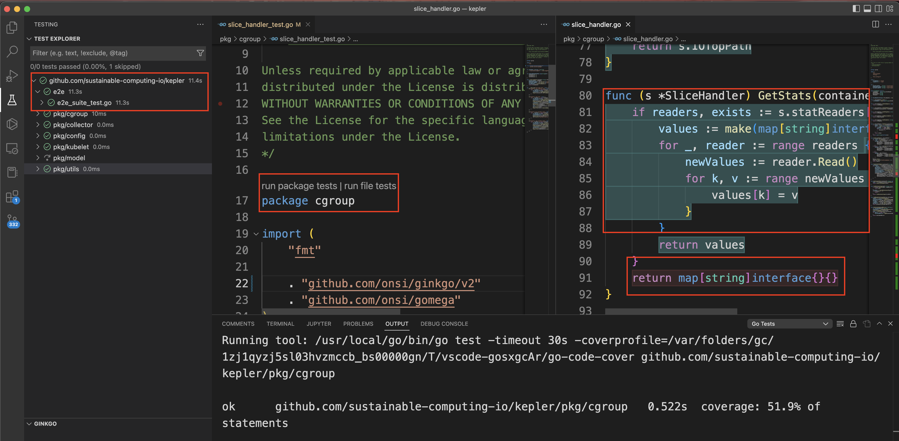

# Upgrade ginkgo to v2 version

## Summary

Upgrade test framework ginkgo to v2 version, so that able to use [vscode plugins](https://marketplace.visualstudio.com/items?itemName=joselitofilho.ginkgotestexplorer) to see test coverage in visual way.

## Motivation

Same as Summary

### Goals

- update go mod to ginkgo v2
- update go vendor
- update test codes
- document as sample
- pass CI

### Non-Goals

Test coverage up to 50%

### Workflow Description

after this change, we are able to 
- Click at left side bar to run all test case at local.
- For any package, open a file click run package tests.
- Find test coverage in visual way, green for covered, red for not.

### Drawbacks
n/A
